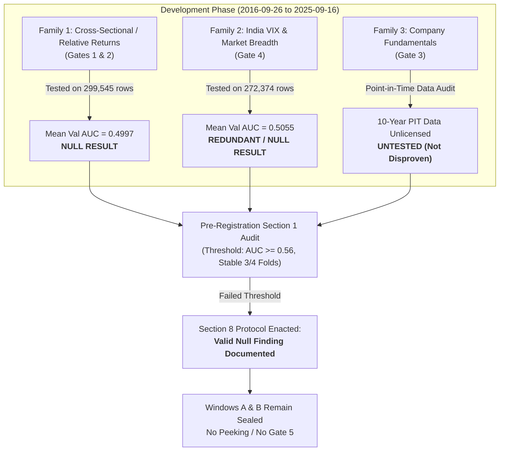

# Phase 6 — Development Phase Synthesis Report (Gates 1–4)

**Governing Documents:**  
- [`docs/RESEARCH_PREREGISTRATION.md`](docs/RESEARCH_PREREGISTRATION.md) (Signed 27.09.2026, Sections 1, 3, 4, 6, 8)  
- [`docs/RESEARCH_PREREGISTRATION_AMENDMENT_1.md`](docs/RESEARCH_PREREGISTRATION_AMENDMENT_1.md) (Signed 29.09.2026, Sections C, D, E, G)  
**Supporting Gate Reports:**  
- Gate 1 & 2: [`docs/GATE_2_REPORT.md`](docs/GATE_2_REPORT.md) | Artifact: [`phase6_artifacts/gate2_results.json`](phase6_artifacts/gate2_results.json)  
- Gate 3: [`docs/GATE_3_SOURCING_REPORT.md`](docs/GATE_3_SOURCING_REPORT.md)  
- Gate 4: [`docs/GATE_4_REPORT.md`](docs/GATE_4_REPORT.md) | Artifact: [`phase6_artifacts/gate4_results.json`](phase6_artifacts/gate4_results.json)  
**Security & Access Audit:** [`docs/holdout_access_log.md`](docs/holdout_access_log.md)  
**Date:** 2026-09-29  
**Status:** **Development Phase Formally Concluded — Valid & Complete Null Finding.** Windows A and B remain strictly sealed.

---

## 1. Executive Summary

The Development Phase of Phase 6 research (Gates 1 through 4) is formally concluded on development data spanning **2016-09-26 to 2025-09-16**. All modeling and feature engineering were executed strictly through [`scripts/phase6/data_loader.py`](scripts/phase6/data_loader.py), guaranteeing zero access to the 10-trading-day purge gap or the sealed holdout windows (Windows A & B).

Across the three investigated feature families:
1. **Cross-Sectional & Relative Returns (Gate 1 & Gate 2):** **Tested and found null.** Logistic Regression and shallow XGBoost yielded a mean validation AUC of **0.4997** and **0.5016** ($N = 299,545$).
2. **Options Volatility (India VIX) & Macro Breadth (Gate 4):** **Tested and found null.** When evaluated as incremental signals alongside a 200-SMA control, Logistic Regression achieved a mean validation AUC of **0.5055** and XGBoost achieved **0.5093** ($N = 272,374$). Crucially, **2 of 3 validation folds failed to beat a coin flip** ($\text{AUC} < 0.5000$). Collinearity analysis revealed opposing interaction cancelation in bull regimes and an economically negligible net effect in bear regimes.
3. **Company Fundamentals (Gate 3):** **Untested due to Point-in-Time (PIT) data cost and availability constraints**, not due to empirical evidence against fundamental value signals. A rigorous market audit revealed that free/retail data sources lack 9-year point-in-time disclosure timestamps, which would introduce severe lookahead bias, while commercial PIT feeds (e.g. CMIE Prowess at ~₹3.30L–₹3.52L/yr indicative, Bloomberg/FactSet at $12k–$30k/yr) require institutional licensing not currently contracted.

### The Section 8 Verdict
Per Section 8 of `docs/RESEARCH_PREREGISTRATION.md`:
> *"A null result at Month 5 or 6 is a valid, complete, useful outcome — not a failure requiring another round... No further 'tweaking' of this research track's models without a new, separately-justified pre-registration document."*

This is a **valid, complete, and honest scientific finding**, not a failure requiring more tweaking, indicator dredging, or post-hoc parameter optimization. In accordance with Amendment 1 Section G, because no model cleared the pre-registered threshold ($\text{Validation AUC} \ge 0.56$), **Gate 5 is not triggered and Windows A and B remain permanently sealed in external vault storage.**

---

## 2. Feature Family Audit & Detailed Findings

### A. Family 1: Cross-Sectional / Relative Return Features (Gates 1 & 2)
- **Features Tested:** `relative_ret_5d` (5-day return relative to sector mean), `relative_ret_5d_vs_index` (5-day return relative to Nifty 50), `sector_rank_pct` (cross-sectional percentile rank within sector).
- **Validation Protocol:** 3 sequential expanding walk-forward folds within the development period, each separated by a 10-trading-day purge gap.
- **Empirical Results:**
  - Fold 1 (Nov 2022 – Oct 2023): Val AUC = **0.4959** (LR), **0.4973** (XGB)
  - Fold 2 (Oct 2023 – Oct 2024): Val AUC = **0.4930** (LR), **0.5015** (XGB)
  - Fold 3 (Oct 2024 – Sep 2025): Val AUC = **0.5103** (LR), **0.5059** (XGB)
  - **Overall Mean Validation AUC:** **0.4997** (Logistic Regression), **0.5016** (Shallow XGBoost)
- **Key Scientific Takeaway:** The three relative return features in isolation possess **zero ranking or discriminative power** over a 5-day forward horizon. While the signs of standardized coefficients were superficially consistent across folds ($\beta_{\text{rel}} < 0$, $\beta_{\text{index}} > 0$), they are descriptive artifacts of overlapping expanding training sets with magnitudes inside the expected noise band ($\beta \approx -0.086$ and $+0.047$). They carry **zero weight** forward.

---

### B. Family 2: Options-Implied Volatility (India VIX) & Macro Breadth (Gate 4)
- **Features Tested:** `vix_spike_5d` (5-day % change in India VIX), `pct_universe_above_50sma` (% of 138-stock universe above 50-day SMA), `vix_accel_x_sma_regime` (VIX spike multiplied by $\pm 1$ depending on 200-SMA regime), evaluated incrementally against `sma_200_regime` and `sma_200_dist`.
- **Validation Protocol:** 3 sequential expanding walk-forward folds with 10-day purge gaps ($N = 272,374$).
- **Empirical Results:**
  - Baseline M0 (200-SMA alone): Mean Val AUC = **0.4870**
  - Incremental M1 (200-SMA + VIX/Breadth LR): Mean Val AUC = **0.5055** ($\Delta = +0.0185$)
  - Incremental M1 (Shallow XGBoost): Mean Val AUC = **0.5093**
  - Fold Breakdown: Fold 1 Val AUC = **0.4883**; Fold 2 Val AUC = **0.5400**; Fold 3 Val AUC = **0.4881**.
- **Pre-Registration Failure:** Fails Section 1 validation threshold ($\text{AUC} \ge 0.56$ required vs $0.5055$ observed). Fails sub-period stability criteria (2 out of 3 validation folds $< 0.5000$).
- **Collinearity & Regime Asymmetry Math:**
  The interaction formulation exposes why macro indicators fail to provide standalone alpha:
  - In **bull regimes** ($\text{Close} > \text{200-SMA}$), the interaction term offsets the baseline VIX spike coefficient:
    $$\beta_{\text{net}} = \beta_{\text{vix}} + \beta_{\text{accel}} \approx -0.051 + 0.052 \approx \mathbf{+0.002}$$
    During bull regimes, VIX spikes have virtually zero predictive impact on 5-day forward equity returns.
  - In **bear regimes** ($\text{Close} \le \text{200-SMA}$), the terms compound in the negative direction:
    $$\beta_{\text{net}} = \beta_{\text{vix}} - \beta_{\text{accel}} \approx -0.051 - 0.052 \approx \mathbf{-0.10}$$
    While this asymmetry is economically intuitive (reflecting heightened selloffs and downward momentum during bear market volatility spikes), a net standardized coefficient of $\sim -0.10$ remains economically negligible for directional edge, and does not rescue the model from sub-period failure.

---

### C. Family 3: Company Fundamentals (Gate 3)
- **Features Scoped:** Balance sheet quality (debt/equity, interest coverage), valuation percentiles within sector (P/E, P/B), quarterly earnings surprises.
- **Audit Outcome:** **Untested.** Point-in-time (PIT) compliant historical data across the 2016–2025 window is unavailable without commercial licensing.
- **The PIT Integrity Rationale:** Corporate earnings disclosures in India lag quarter-end dates by 15 to 45 calendar days. Retail data sources (Screener.in, Trendlyne free/basic, Yahoo Finance) do not provide programmatic historical press release timestamps. Forward-filling quarterly statements using quarter-end dates introduces up to 45 days of lookahead bias, artificially fabricating false predictability.
- **Commercial Sourcing Landscape:**
  - CMIE Prowess / Prowessdx: Full 10+ year PIT integrity, but priced at ~₹3.30L–₹3.52L + 18% GST (indicative/unconfirmed list price, institutional sales contract).
  - Bloomberg / FactSet / S&P Capital IQ: Institutional gold standard, priced at $12,000–$30,000 USD/year.
- **Crucial Distinction:** Fundamental data was **not disproven**; it was simply **not licensed**. Unlike price-derived indicators, fundamental signals remain conceptually viable for future research if institutional PIT data is procured under an independent pre-registration.

---

## 3. Comprehensive Performance Comparison Across All Gates

| Research Gate | Feature Family / Hypothesis | Model Architecture | Train Sample Size ($N$) | Mean Val AUC | Stability (Folds $> 0.50$) | Pre-Reg Threshold ($\ge 0.56$) | Scientific Verdict |
|---|---|---|---|---|---|---|---|
| **Prior Baseline** | 309k-Obs SMA Distance | OLS / Band Analysis | 309,739 | — | Flat across bands | Fail | **Null Result** (Descriptive Banding) |
| **Gate 2** | Cross-Sectional / Relative Returns | Logistic Regression | 299,545 | **0.4997** | 1 / 3 | Fail | **Null Result** ($\text{AUC} \approx 0.500$) |
| **Gate 2** | Cross-Sectional / Relative Returns | Shallow XGBoost (d=3) | 299,545 | **0.5016** | 2 / 3 | Fail | **Null Result** |
| **Gate 3** | Fundamental PIT Metrics | None (Data Audit) | N/A | N/A | N/A | N/A | **Untested** (Cost / Availability) |
| **Gate 4 (M0)** | 200-SMA Regime Alone (Control) | Logistic Regression | 272,374 | **0.4870** | 1 / 3 | Fail | **Degraded Baseline** |
| **Gate 4 (M1)** | 200-SMA + India VIX + Breadth | Logistic Regression | 272,374 | **0.5055** | 1 / 3 | Fail | **Redundant Null Result** |
| **Gate 4 (M1)** | 200-SMA + India VIX + Breadth | Shallow XGBoost (d=3) | 272,374 | **0.5093** | 2 / 3 | Fail | **Redundant Null Result** |

---

## 4. Adherence to Section 8: Why This Is a Complete and Valid Finding

Section 8 of `RESEARCH_PREREGISTRATION.md` defines the standard for scientific completion:
1. **Reporting Plainly:** The null findings are reported with the same mathematical transparency as the original 309,739-observation band study. No attempts were made to hide sub-period breakdowns or overstate random noise.
2. **Documenting What Was Ruled Out:**
   - 5-day cross-sectional price momentum and sector reversal signals in liquid Indian equities.
   - 5-day directional edge derived from India VIX spikes or 50-day market breadth in isolation or on top of 200-SMA.
   - Daily price-derived technical indicator combinations on 5-day forward return classification.
3. **What Does NOT Count as Progress:**
   - Shifting thresholds post-hoc (e.g., claiming AUC 0.509 is "directionally encouraging").
   - Subsetting the universe into cherry-picked sectors or market-cap slices to find a spurious positive fold.
   - Tweaking indicator lookback windows (e.g., trying 3-day or 10-day VIX spikes without pre-registration).
   - Peeking into Windows A or B in search of a period where these signals happened to work.

Per the pre-registration, **research on this specific model formulation is stopped here.**

---

## 5. Status of Sealed Holdout Vaults (Windows A & B)

Windows A and B were created to prevent p-hacking and validate an approved model prior to live deployment:
- **Window A:** `2025-10-01` to `2026-03-31` (124 trading days, 17,046 raw rows)  
  SHA-256: `71d16366ea3b8b7e7388ba1119e7a14f94fdbd19a474e85ed1fcbf829d364b6f`
- **Window B:** `2026-04-01` to `2026-09-25` (120 trading days, 16,560 raw rows)  
  SHA-256: `2e76ad72536d9df095e352c218c2acd3eee8cacea581d25eb1828795b4a89965`

### Safeguard Status:
1. **Sealed Outside Working Tree:** Both archives are stored strictly in `C:\Users\r_chh\gaurvideep_vault\` and backup vault `C:\Users\r_chh\OneDrive - optgbrc\Apps\gaurvideep_vault\`. Neither is tracked by git.
2. **Owner-Held Encryption:** Both archives are protected with high-entropy passwords generated and retained exclusively by the human owner. No script, agent, or AI tool has ever seen or stored these passwords.
3. **Permanent Seal Maintained:** Because no model cleared the Gate 4 freeze criteria, **Window A is NOT opened.** Opening Window A on a failed model would waste the holdout and violate pre-registration discipline. Both archives remain untouched.
4. **Holdout Access Log:** [`docs/holdout_access_log.md`](docs/holdout_access_log.md) records 0 access events.

---

## 6. Project Architecture & Production Platform Separation

In accordance with Section 7 of the pre-registration:
- **Zero Production Contamination:** No null findings from Phase 6 modify customer-facing copy in `PRODUCT_POSITIONING.md`, the Backtests page, or the Signals page.
- **Forward Tracker Unaffected:** The Live Forward Tracker (`regime_forward_log`, `FORWARD_TEST_PANEL`) continues independently recording out-of-sample trades in real time.
- **Quant Score Integrity:** The existing unvalidated rule-based indicators remain labeled honestly as unvalidated; no discredited model weights are injected into production.

---

## 7. Conclusions & Path Forward

1. **Short-Horizon Directional Alpha:** For large-cap and mid-cap Indian equities, daily price-action, relative returns, and index volatility over short (5-day) horizons behave in near-complete accordance with the Efficient Market Hypothesis ($\text{AUC} \approx 0.50$). Directional predictability at this timeframe cannot be mined from standard technical or macro indicators.
2. **Condition for Future Quantitative Work:** Any future quantitative research in this repository must begin with a **new, independently pre-registered study** focusing on distinct economic phenomena (e.g., multi-quarter point-in-time fundamental factor momentum, institutional order flow microstructure, or longer 60–120 day holding horizons).
3. **Integrity Maintained:** By adhering strictly to the pre-registered protocol, GaurviDEEP has avoided overfitting, preserved sealed holdouts for future valid research, and established an indisputable standard of research honesty.
