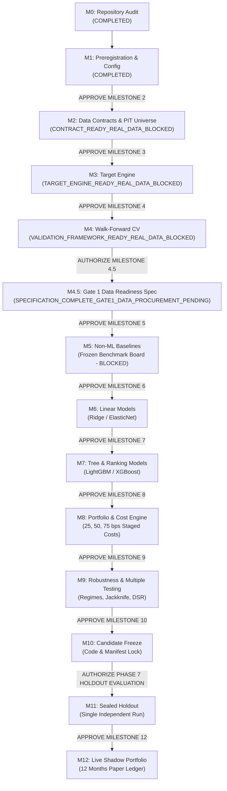

# Phase 7 — Operational Execution Plan

**Repository:** GaurviDEEP
**Working Branch:** `phase7-research`
**Governing Document:** [`docs/PHASE7_RESEARCH_PREREGISTRATION.md`](PHASE7_RESEARCH_PREREGISTRATION.md)
**Standard Environment:** Python 3.12 (`.venv-phase7`)
**Status Date:** 2026-10-05

---

## 1. Programme Overview & Governance Milestones

The Phase 7 research programme progresses through 13 sequential, tightly audited milestones. Progression between milestones is blocked by default and requires verified test execution, zero data leakage, and explicit owner authorization.

---

## 2. Milestone Execution Protocols

### Milestone 0: Read-Only Repository Audit (COMPLETED)
- **Objective:** Audit existing repository architecture, data availability, date ranges, and Phase 6 boundaries.
- **Output:** `docs/PHASE7_REPOSITORY_AUDIT.md`, `docs/PHASE7_BLOCKERS.md`, `docs/PHASE7_IMPLEMENTATION_MAP.md`.
- **Verdict:** Clean working tree; identified BLK-01 (PIT Universe) and BLK-02 (OHLCV Turnover) as critical blockers.

### Milestone 1: Preregistration and Configuration (COMPLETED)
- **Objective:** Author binding preregistration, machine-readable YAML configuration with integer basis points, governance schemas, and boundary test suites.
- **Rules:** No model training; no synthetic data for economic metrics; no modification of Phase 6 files.
- **Required Approval Phrase:** `APPROVE MILESTONE 1` (Received).

### Milestone 2: Data Contracts and Point-in-Time Universe (COMPLETED)
- **Objective:** Author canonical data schemas, PIT constituent membership builder, liquidity filters, corporate action adjustments, and survivorship-bias verification suites.
- **Handling Data Blockers:** Interfaces, schemas, validators, and unit fixtures implemented; research status marked `CONTRACT_READY_REAL_DATA_BLOCKED`. Real financial data not invented.
- **Required Approval Phrase:** `APPROVE MILESTONE 2` (Received).

### Milestone 3: Target Engine (COMPLETED - TARGET_ENGINE_READY_REAL_DATA_BLOCKED)
- **Objective:** Implement `phase7/targets/` modular engine for 20-day sector-relative return and 60-day beta-adjusted residual return, T+1 forward alignment, terminal policies, cutoff truncation, overlap detection, readiness gate, and zero-performance quality audit.
- **Mandatory Integrity:** Strict $t+1$ executable price alignment (next-session entry); dividend adjustment; target columns completely isolated from feature matrix; zero performance metric calculation. Verified on synthetic fixtures; real historical target generation deferred pending BLK-01, BLK-02, BLK-04. Research status explicitly set to `TARGET_ENGINE_READY_REAL_DATA_BLOCKED`.
- **Required Approval Phrase:** `APPROVE MILESTONE 3` (Received).

### Milestone 4: Walk-Forward Validation Framework (COMPLETED - VALIDATION_FRAMEWORK_READY_REAL_DATA_BLOCKED)
- **Objective:** Build expanding walk-forward fold generator ($\ge 10$ windows) with 20-day purge gap and 5-day embargo (60d purge gap and 10d embargo for secondary target).
- **Leakage Controls:** Fold-local preprocessing (scaling, winsorization, ranking fitted exclusively on training slices).
- **Boundary Verification:** Purge and embargo use ordered trading sessions (not calendar days); training-label outcome windows cannot overlap validation sessions; validation observations do not influence preprocessing fitting; all fold hashes include fold boundaries, configuration version, target specification, and dataset-version metadata; cross-sectional ranking is performed separately by session date; no real fold calendar is generated while BLK-01, BLK-02, and BLK-04 remain open. Research status explicitly set to `VALIDATION_FRAMEWORK_READY_REAL_DATA_BLOCKED`.
- **Required Approval Phrase:** `APPROVE MILESTONE 4` (Received).

### Milestone 4.5: Gate 1 Data Readiness Specification (COMPLETED - SPECIFICATION_COMPLETE_GATE1_DATA_PROCUREMENT_PENDING)
- **Objective:** Author comprehensive data acquisition specifications, vendor evaluation matrix, Gate 1 acceptance protocols, data source technical due diligence checklist, and legal licensing verification checklist.
- **Scope & Dates:** Define requirements for resolving BLK-01 (PIT Nifty 500 Membership), BLK-02 (Historical Daily OHLCV & Traded Value), and BLK-04 (PIT Sector Classification) across 2014-01-01 to 2025-09-16.
- **Strict Boundary:** No data downloaded or scraped; no vendors contacted; no model training; Milestone 5 remains strictly BLOCKED until real data passes Gate 1 acceptance.
- **Required Authorization Phrase:** `AUTHORIZE MILESTONE 4.5: GATE 1 DATA READINESS SPECIFICATION` (Received).

### Milestone 4.7: Existing Connector NIFTY 500 Capability Audit & Pilot (COMPLETED - NSE_CONNECTOR_PILOT_FAILED)
- **Objective:** Discover existing application connectors for NIFTY 500 constituent and historical data retrieval, conduct a 17-point safety review, and execute a tightly controlled 5-security pilot for 2024-01-01 to 2024-01-31.
- **Pilot Outcome:** Pilot failed preconditions and safety gates. The application contains zero NIFTY 500 constituent retrieval code, hardcodes trailing 365-day dates, omits traded value turnover in INR, and fails runtime import in .venv-phase7.
- **Safety Halt:** Full acquisition halted per pilot acceptance protocol. Zero raw market data committed. BLK-01, BLK-02, and BLK-04 remain strictly blocked. Research status set to NSE_CONNECTOR_PILOT_FAILED.
- **Required Authorization Phrase:** AUTHORIZE MILESTONE 4.7: EXISTING CONNECTOR NIFTY 500 DATA ACQUISITION (Received).

### Milestone 5: Non-ML Baselines (BLOCKED PENDING GATE 1 REAL DATA)
- **Objective:** Evaluate Equal-Weight universe, Sector-Neutral Equal-Weight, 12-1 Momentum, and simple SUE composite across walk-forward folds.
- **Leaderboard:** Record frozen baseline metrics (Rank IC, Sharpe, Drawdown, Monotonicity) at 25, 50, and 75 bps costs.
- **Prerequisite:** Gate 1 acceptance (`GATE1_PASS` or authorized `GATE1_CONDITIONAL_PASS`) on real historical dataset resolving BLK-01, BLK-02, and BLK-04.
- **Required Approval Phrase:** `APPROVE MILESTONE 5`.

### Milestone 6: Linear Models
- **Objective:** Train and evaluate fold-local Ridge Regression and Elastic Net models with cross-sectional ranking output.
- **Registry:** Append all trial parameters and metrics to `artifacts/phase7/experiment_registry.jsonl`.
- **Required Approval Phrase:** `APPROVE MILESTONE 6`.

### Milestone 7: Tree Regressors & Ranking Models
- **Objective:** Train constrained LightGBM and XGBoost models (regression and LambdaRank / pairwise ranking objectives).
- **Complexity Limits:** Max depth $\le 4$; feature importance stability evaluated across folds.
- **Required Approval Phrase:** `APPROVE MILESTONE 7`.

### Milestone 8: Portfolio Construction & Cost Engine
- **Objective:** Construct Top-20 long-only portfolios with weekly rebalancing, 500 bps stock cap, 2500 bps sector cap, and staged transaction cost deductions (25, 50, 75 bps).
- **Required Approval Phrase:** `APPROVE MILESTONE 8`.

### Milestone 9: Robustness, Regime Stability & Multiple Testing
- **Objective:** Evaluate performance across 6 predefined market regimes, sector concentration, jackknife stability (drop best month / top 5 trades), Deflated Sharpe Ratio ($\ge 90\%$), and Probability of Backtest Overfitting.
- **Required Approval Phrase:** `APPROVE MILESTONE 9`.

### Milestone 10: Development Candidate Freeze
- **Objective:** Lock winning model artifact SHA-256, code commit, hyperparameter dictionary, and generate `docs/PHASE7_CANDIDATE_MODEL_CARD.md`.
- **Constraint:** Zero access to any holdout dataset.
- **Required Approval Phrase:** `APPROVE MILESTONE 10`.

### Milestone 11: Sealed Phase 7 Historical Holdout Evaluation
- **Objective:** Perform single unblinded evaluation on newly generated Phase 7 holdout vault.
- **Mandatory Prerequisite:** Explicit owner authorization phrase `AUTHORIZE PHASE 7 HOLDOUT EVALUATION`.
- **Strict Prohibition:** Never access Phase 6 vaults (`gaurvideep_vault`, `window_a_sealed.7z`, `window_b_sealed.7z`).

### Milestone 12: Live Shadow Portfolio
- **Objective:** Deploy weekly paper-trading prediction ledger issuing `SELECT`, `WATCH`, or `NO_QUALIFYING_OPPORTUNITY` over 12 months with $t+1$ execution tracking.
- **Required Approval Phrase:** `APPROVE MILESTONE 12`.

---

## 3. Exact Approval Phrases Matrix

| Target Milestone | Prerequisite Gate | Exact Owner Approval Phrase Required |
|---|---|---|
| Milestone 1 | Milestone 0 Audit | `APPROVE MILESTONE 1` |
| Milestone 2 | Milestone 1 Preregistration Committed | `APPROVE MILESTONE 2` |
| Milestone 3 | Data Contracts & Universe Tests Passing | `APPROVE MILESTONE 3` |
| Milestone 4 | Target Engine Verified | `APPROVE MILESTONE 4` |
| Milestone 4.5 | Validation Framework Ready | `AUTHORIZE MILESTONE 4.5: GATE 1 DATA READINESS SPECIFICATION` |
| Milestone 4.8 | Static Audit & Safe Adapter Built | `AUTHORIZE MILESTONE 4.8: EXISTING NSE DATA FETCHER INTEGRATION AND SAFETY REMEDIATION` |
| Milestone 4.9 | Five-Stock Live Pilot | `AUTHORIZE MILESTONE 4.9: FIVE-STOCK NSE LIVE PILOT` |
| Milestone 5 | Gate 1 Real Data Accepted | `APPROVE MILESTONE 5` |
| Milestone 6 | Baseline Board Frozen | `APPROVE MILESTONE 6` |
| Milestone 7 | Linear Models Registered | `APPROVE MILESTONE 7` |
| Milestone 8 | Ranking Models Registered | `APPROVE MILESTONE 8` |
| Milestone 9 | Portfolio & Cost Tests Passing | `APPROVE MILESTONE 9` |
| Milestone 10 | Gate 2 & Gate 3 Criteria Passed | `APPROVE MILESTONE 10` |
| Milestone 11 | Development Candidate Frozen | `AUTHORIZE PHASE 7 HOLDOUT EVALUATION` |
| Milestone 12 | Holdout Gate 4 Passed | `APPROVE MILESTONE 12` |
