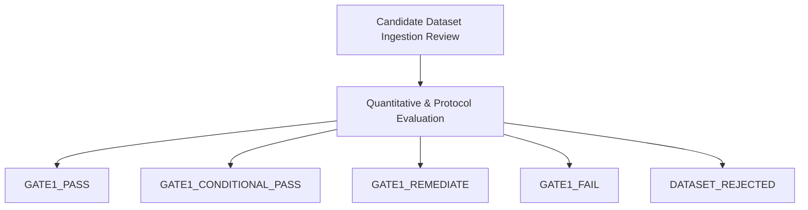

# Phase 7 — Gate 1 Data Acceptance Protocol

## 1. Overview and Purpose

This document defines the formal Gate 1 Data Acceptance Protocol for GaurviDEEP Phase 7. The Gate 1 protocol governs the transition from procurement/preparation to ingest-stage verification of the point-in-time (PIT) research dataset.

Gate 1 serves as the **hard cryptographic and quantitative quality boundary** that must be satisfied before any real historical dataset can be accepted into the research repository or utilized for universe selection, feature engineering, label creation, cross-sectional modeling, or backtesting.

### Scope of Gate 1 Review
The Gate 1 protocol evaluates data resolving the foundational research blockers:
- **BLK-01**: Historical Point-in-Time Nifty 500 Membership & Constituents (2014-01-01 to 2025-09-16)
- **BLK-02**: Historical Daily Market Data (OHLCV, exchange-reported turnover, trades, delivery)
- **BLK-03**: Corporate Actions (splits, bonuses, dividends, mergers, demergers, delistings)
- **BLK-04**: Historical Point-in-Time Sector & Industry Classification

Gate 1 does **not** evaluate model performance, IC, or returns. Gate 1 exclusively verifies **data integrity, completeness, PIT validity, identifier stability, and legal provenance**.

---

## 2. Gate 1 Quantitative Quality Thresholds

Any candidate dataset submitted for Gate 1 acceptance must be evaluated against the following strict quantitative metrics across the entire research interval (**2014-01-01 through 2025-09-16**, minimum 2,850 trading sessions):

| Metric ID | Criterion Description | Metric Calculation / Definition | Required Threshold | Severity if Breached |
| :--- | :--- | :--- | :--- | :--- |
| **G1-MET-01** | Historical Membership Coverage | $\frac{\text{Sessions with Valid Index Composition}}{\text{Total NSE Capital Market Trading Sessions}} \times 100$ | $\ge 99.5\%$ | Critical Fail |
| **G1-MET-02** | Expected Trading-Session Coverage | $\frac{\text{Actual Constituent Session Rows Observed}}{\text{Expected Active Constituent Sessions}} \times 100$ | $\ge 99.5\%$ | Critical Fail |
| **G1-MET-03** | Eligible Record ISIN Coverage | $\frac{\text{Records with Valid 12-char Verified ISIN}}{\text{Total Universe Records}} \times 100$ | $= 100.0\%$ | Critical Fail |
| **G1-MET-04** | Unresolved Duplicate Natural Keys | Count of duplicate rows on `(trading_date, isin)` or `(trading_date, symbol, exchange_series)` | $= 0$ | Critical Fail |
| **G1-MET-05** | Contradictory Membership Intervals | Overlapping or mutually contradictory interval definitions: `[effective_from, effective_to]` per security | $= 0$ | Critical Fail |
| **G1-MET-06** | Future Timestamp Violations | Records where `source_timestamp > effective_date` or publication date postdates observation date | $= 0$ | Critical Fail |
| **G1-MET-07** | Unknown Adjustment State | Records with null, empty, or unverified `price_adjustment_state` | $= 0$ | Critical Fail |
| **G1-MET-08** | Unresolved Corporate Action Conflicts | Conflicting adjustment ratios, ex-dates, or unmapped restructurings | $= 0$ | Critical Fail |
| **G1-MET-09** | Missing Sector Classification | $\frac{\text{Records with Missing/Null Sector Classification}}{\text{Total Active Universe Records}} \times 100$ | $< 0.5\%$ | Remediation / Hold |
| **G1-MET-10** | Unexplained Symbol-to-ISIN Conflicts | Symbols mapping to divergent ISINs without a logged corporate action / identifier change event | $= 0$ | Critical Fail |
| **G1-MET-11** | Derived Turnover Labeling | Turnover values derived from $P \times V$ lacking explicit `DERIVED_FROM_PRICE_VOLUME` provenance | $= 0$ | Critical Fail |
| **G1-MET-12** | Forward-Looking Survivorship Leakage | Delisted / defunct historical constituents omitted from historical universe intervals | $= 0$ | Critical Fail |

---

## 3. Mandatory Verification Manifests and Artifacts

No dataset may undergo Gate 1 review without the accompanying bundle of signed manifests:

### 3.1 Dataset Checksum Manifest (`manifest_checksums.sha256`)
- Every raw ingestion file, transformed partition, and lookup table must possess a SHA-256 cryptographic hash.
- File integrity must be verifiable via `sha256sum -c manifest_checksums.sha256`.
- Any mismatch immediately triggers `DATASET_REJECTED`.

### 3.2 Dataset Version Manifest (`manifest_version.json`)
- Unique semantic version identifier (e.g., `phase7-pit-dataset-v1.0.0`).
- Exact snapshot timestamp (UTC).
- Git commit hash of the ingestion specification and pipeline code used.
- Schema compatibility version mapping.

### 3.3 Source Provenance Manifest (`manifest_provenance.json`)
- Primary vendor / exchange source identifier (e.g., `NSE_HISTORICAL_EOD`, `REFINITIV_DATASTREAM`).
- Ingestion batch ID and ingest timestamp (UTC).
- Source document references (e.g., circular numbers, EOD master snapshot file names).
- Clear audit chain linking each record's `row_hash` to the upstream raw archive.

### 3.4 Licensing Documentation Package (`licensing_docket/`)
- Fully executed vendor data agreement or formal owner-attested authorization memorandum.
- Verification checklist matching `docs/PHASE7_DATA_LICENSING_CHECKLIST.md`.
- Explicit written confirmations of model training, internal research, derived analytics, and retention rights.

### 3.5 Rejected-Record Ledger (`rejected_records.parquet` or `.jsonl`)
- Complete log of any candidate row rejected during pre-ingestion or cleansing.
- Fields: `source_file`, `line_number`, `natural_key`, `rejection_reason_code`, `record_payload`, `timestamp`.
- Total rejection rate must not exceed $0.1\%$ of total input volume without an approved exception.

---

## 4. Test Suites Required for Gate 1 Clearance

Gate 1 requires 100% pass rates across four automated test suites executed in `.venv-phase7\Scripts\python.exe`:

### 4.1 Point-in-Time Timing Tests (`tests/phase7/pit/`)
1. **Lookahead Prohibition**: No feature, label, or universe membership record may use information whose source publication timestamp is after the designated decision cutoff time (15:30 IST / EOD on $T$).
2. **Interval Consistency**: All `effective_from` dates must be $\le$ `effective_to` dates.
3. **No Retrospective Restatements**: Revisions made on $T_{rev}$ must not overwrite raw historical state observed at $T < T_{rev}$; revisions must append as distinct effective intervals.

### 4.2 Survivorship Tests (`tests/phase7/survivorship/`)
1. **Delisting Persistence**: Confirms securities that delisted (e.g., via bankruptcy, liquidation, or merger) between 2014 and 2025 remain present in the universe during their active listing window.
2. **Post-Delisting Zero-Weight**: Confirms that upon delisting, the security is immediately marked non-investable with no synthetic zero-returns distorting cross-sectional ranks.
3. **Suspension Handling**: Confirms trading halts and circuit suspensions are explicitly flagged (`trading_status == SUSPENDED`) rather than dropped or populated with stale forward-filled prices.

### 4.3 Corporate Action Tests (`tests/phase7/corporate_actions/`)
1. **Raw Price Invariance**: Raw OHLCV records must never be retrospectively price-adjusted in-place.
2. **Split/Bonus Factor Precision**: Split and bonus ratios must correctly calculate unadjusted and backward-adjusted series without compounding floating-point drift.
3. **Cash Dividend Ex-Date Alignment**: Ex-dates must match exchange circulars; dividend amounts must match approved declarations.
4. **Demerger Cost Apportionment**: Spun-off entities must be tied to parent records with exact cost-of-acquisition apportionment dates.

### 4.4 Source-Adapter Tests (`tests/phase7/adapters/`)
1. **Schema Conformance**: All columns match types, nullability, and constraints specified in `docs/PHASE7_DATA_ACQUISITION_SPECIFICATION.md`.
2. **Idempotent Ingestion**: Repeated ingestion of the same raw source files must produce identical row hashes and tables.
3. **Boundary Date Enforcement**: Date ranges strictly satisfy $[2014-01-01, 2025-09-16]$.

---

## 5. Gate 1 Evaluation Outcomes

The Gate 1 evaluation concludes with exactly one of five formal outcomes:

### 5.1 `GATE1_PASS`
- **Definition**: All quantitative metrics meet or exceed required thresholds. All manifests, licensing dockets, and test suites pass with zero defects.
- **Authorization**: **Authorizes commencement of Milestone 5** (Universe Construction & Point-in-Time Ingestion).

### 5.2 `GATE1_CONDITIONAL_PASS`
- **Definition**: Minor non-structural discrepancies identified that meet the strict boundary condition:
  > *A conditional pass must not authorize Milestone 5 unless the remaining conditions cannot affect eligibility, labels, sectors, liquidity or corporate-action adjustment.*
- **Criteria for Conditional Pass**:
  - Genuinely inconsequential formatting discrepancies in non-feature fields (e.g., missing security display names for a historical period where ISIN and symbol are verified).
  - Isolated non-constituent record anomalies outside the Nifty 500 universe.
- **Milestone 5 Restriction**: If any unresolved item could affect universe membership, return calculations, sector grouping, ADV calculations, or split adjustments, **Milestone 5 remains strictly blocked** until remediation is verified.

### 5.3 `GATE1_REMEDIATE`
- **Definition**: Systematic data defect identified that is remediable by the vendor or pipeline without rejecting the core dataset.
- **Examples**: Missing deliverable quantity for a specific 3-month window; incorrect date formatting in sector classification history; incomplete mapping of an identified symbol rename.
- **Action**: Dataset placed on hold. A formal Remediation Notice is issued. Gate 1 review is paused until a corrected version manifest is delivered. Milestone 5 remains **BLOCKED**.

### 5.4 `GATE1_FAIL`
- **Definition**: Substantive failure against core quantitative criteria (e.g., membership coverage $< 99.5\%$, lookahead timestamp leakage detected, widespread duplicate keys, unresolvable identifier splits).
- **Action**: Candidate dataset failed. Must not be used for research. Requires pipeline redesign or alternative vendor sourcing. Milestone 5 remains **BLOCKED**.

### 5.5 `DATASET_REJECTED`
- **Definition**: Fundamental defect in licensing, legal provenance, source legitimacy, or cryptographic integrity (e.g., checksum mismatch, unauthorized scraping, lack of model-training rights, pervasive survivorship bias).
- **Action**: Immediate purge and deletion of candidate files from research environments. Complete disqualification of data batch. Milestone 5 remains **BLOCKED**.

---

## 6. Sign-off and Gate 1 Transition Protocol

Transitioning from Gate 1 to Milestone 5 requires:
1. Completion of the Gate 1 Acceptance Report signed by the Research Lead and Governance Officer.
2. Verification in Git history that `docs/PHASE7_BLOCKERS.md` has formally updated BLK-01, BLK-02, and BLK-04 from `OPEN` to `RESOLVED` with explicit reference to the accepted dataset version manifest.
3. Successful execution of all pre-flight safeguard checks.
