# Phase 7 — Technical Implementation Map

**Repository:** GaurviDEEP
**Working Branch:** `phase7-research`
**Base Commit:** `c978968ec822aa20453920c8708673fcaa736695`
**Governing Standard:** Pre-registered, modular, fail-closed quantitative research architecture.
**Created:** 2026-10-05

---

## 1. Architectural Architecture & Module Mapping

```mermaid
flowchart TD
    subgraph Phase7Package["Dedicated Phase 7 Package (phase7/)"]
        subgraph Data["1. Data Engine (phase7/data/)"]
            Contracts["contracts.py<br/>(Pydantic Schemas & Hashes)"]
            Universe["universe.py<br/>(PIT Nifty 500 Builder)"]
            Loaders["loaders.py<br/>(Cutoff-Enforced Loaders)"]
            CAEngine["corporate_actions.py<br/>(Splits & Bonuses)"]
        end

        subgraph Targets["2. Target Engine (phase7/targets/)"]
            T20["engine.py<br/>(20d Sector-Relative & 60d Residual)"]
        end

        subgraph Validation["3. Validation (phase7/validation/)"]
            WF["walk_forward.py<br/>(10 Expanding Folds)"]
            PE["purge_embargo.py<br/>(Purge >=20d, Embargo >=5d)"]
        end

        subgraph Features["4. Features (phase7/features/)"]
            Mom["momentum.py<br/>(12-1m, 6m Rel, 3m Res)"]
            Qual["quality.py<br/>(SUE, Cash Flow, Dilution)"]
            Val["valuation.py<br/>(Percentiles, Yields)"]
        end

        subgraph Models["5. Models (phase7/models/)"]
            Baselines["baselines.py<br/>(EW, Sector-Neutral, Momentum)"]
            Linear["linear.py<br/>(Ridge, ElasticNet)"]
            Trees["tree.py<br/>(LightGBM, XGBoost)"]
            Rankers["ranking.py<br/>(LambdaRank)"]
        end

        subgraph Portfolio["6. Portfolio & Execution (phase7/portfolio/)"]
            Cons["construction.py<br/>(Top 20 Long-Only, EW)"]
            Costs["costs.py<br/>(25, 50, 75 bps Staged Costs)"]
            Risk["constraints.py<br/>(Max 5% Stock, 25% Sector)"]
        end

        subgraph Metrics["7. Metrics & Robustness (phase7/metrics/)"]
            RankIC["ranking.py<br/>(Rank IC, Monotonicity)"]
            Perf["performance.py<br/>(Sharpe, Sortino, Calmar, MaxDD)"]
            Robust["deflated_sharpe.py<br/>(Bootstrap, DSR, PBO)"]
        end

        subgraph Gov["8. Governance & Auditing (phase7/governance/)"]
            Reg["registry.py<br/>(Append-Only Experiment Store)"]
            DecLog["decision_log.py<br/>(Decision Ledger)"]
            Bound["boundary.py<br/>(Phase 6 Vault Defense)"]
        end

        subgraph Shadow["9. Live Shadow (phase7/live_shadow/)"]
            Ledger["ledger.py<br/>(Append-Only Predictions)"]
            Eval["evaluator.py<br/>(T+1 Executable Returns)"]
        end
    end

    Data --> Targets
    Data --> Features
    Targets --> Validation
    Features --> Validation
    Validation --> Models
    Models --> Portfolio
    Portfolio --> Metrics
    Metrics --> Gov
    Gov --> Shadow
```



---

## 2. Existing Modules to Reuse vs Quarantined Code

### 2.1 Existing Modules to Reuse (with Adaptation)
1. **`scripts/phase6/corporate_action_engine.py` $\to$ `phase7/data/corporate_actions.py`:**
   - Reuse verified regex parsing for NSE bonus and split circulars (`bonus N:D`, `split from X to Y`).
   - Enhance to handle cash dividends and compute cumulative Total Return adjustment factors.
2. **`scripts/phase6/data_loader.py` Pattern $\to$ `phase7/data/loaders.py`:**
   - Adopt the strict fail-closed boundary enforcement pattern (`_validate_date_bounds`, `PreRegistrationDataLeakError`).
   - Reconfigure for Phase 7 temporal split boundaries and multi-table schemas.
3. **`data/fundamentals/sue_features_quarterly.csv`:**
   - Ingest as verified historical point-in-time standardized unexpected earnings data for 134 equities (2018–2025).
4. **`scripts/verification/*_stress_test.py` $\to$ `phase7/metrics/robustness.py`:**
   - Reuse calculation logic for maximum drawdowns, underwater series, and Covid-period regime stress slicing.

### 2.2 Modules Requiring Complete Isolation or Quarantining
1. **`features/universe.py`:**
   - **Status:** The static legacy universe is prohibited as a Phase 7 universe provider and protected by automated boundary tests.
   - **Phase 7 Replacement:** `phase7/data/universe.py` constructs dynamic, point-in-time universes per date.
2. **`features/indicators.py`:**
   - **Quarantine:** Contains 27 legacy technical indicators (RSI, MACD, Stochastics, Williams %R) which are not authorized in Phase 7 without an approved preregistered amendment.
3. **`service/app.py` & `service/routes_*.py`:**
   - **Quarantine:** Production API endpoints. Phase 7 research code must have zero runtime coupling with FastAPI service routes.
4. **`service/models/*`:**
   - **Quarantine:** Legacy model weights (`.pt`, `.pkl`) and cached states must never be loaded into Phase 7 pipelines.
5. **Phase 6 Scripts (`scripts/phase6/*`):**
   - **Quarantine:** Phase 6 models evaluated single-stock 5-day directional binary labels. Must remain untouched as historical records.

---

## 3. Proposed Phase 7 Package Structure

```
GaurviDEEP/
├── config/
│   └── phase7.yaml                     # Frozen Phase 7 research configuration
├── phase7/
│   ├── __init__.py
│   ├── data/
│   │   ├── __init__.py
│   │   ├── contracts.py                # Pydantic schemas, column validators, hash checkers
│   │   ├── universe.py                 # Point-in-time eligible universe builder & filters
│   │   ├── loaders.py                  # Strict time-bounded data loaders with fail-closed checks
│   │   └── corporate_actions.py        # Corporate action split/bonus/dividend adjustment engine
│   ├── targets/
│   │   ├── __init__.py
│   │   ├── contracts.py                # TargetSpecificationRecord, PredictionEventRecord, observation records, enums
│   │   ├── returns.py                  # Discrete return calculation, price adjustment compatibility validation
│   │   ├── alignment.py                # T+1 forward trading date alignment engine, session counting, duplicate checks
│   │   ├── sector_relative.py          # 20-day sector-relative forward target calculation engine, PIT sector resolution
│   │   ├── residual.py                 # 60-day beta-adjusted residual target calculation engine, PIT beta validation
│   │   └── audit.py                    # Target dataset quality audit, zero-performance invariant enforcement
│   ├── features/
│   │   ├── __init__.py
│   │   ├── momentum.py                 # 12-1m, 6m sector-rel, 3m residual, 52w high distance
│   │   ├── quality.py                  # SUE, cash flow, debt, margin, and dilution metrics
│   │   └── valuation.py                # Sector-relative valuation percentiles and yields
│   ├── validation/
│   │   ├── __init__.py
│   │   ├── walk_forward.py             # >=10 expanding walk-forward fold generator
│   │   └── purge_embargo.py            # Purge (>=20d) and embargo (>=5d) interval masking
│   ├── models/
│   │   ├── __init__.py
│   │   ├── baselines.py                # EW universe, Sector-neutral EW, 12-1 Momentum, Composites
│   │   ├── linear.py                   # Fold-local Ridge regression, ElasticNet
│   │   ├── tree.py                     # Constrained LightGBM & XGBoost regressors
│   │   └── ranking.py                  # LightGBM LambdaRank & XGBoost pairwise ranking
│   ├── portfolio/
│   │   ├── __init__.py
│   │   ├── construction.py             # Top 20 long-only, weekly rebalance, equal-weight allocation
│   │   ├── costs.py                    # Granular transaction-cost engine (STT, GST, spread, impact)
│   │   └── constraints.py              # Max 5% stock, 25% sector, liquidity cap (<=5% 60d MDTV)
│   ├── metrics/
│   │   ├── __init__.py
│   │   ├── ranking.py                  # Cross-sectional Rank IC, monotonicity, quintile spreads
│   │   ├── performance.py              # Net Sharpe, Sortino, Calmar, Max Drawdown, Turnover
│   │   └── deflated_sharpe.py          # Block-bootstrap CIs, Deflated Sharpe, PBO estimation
│   ├── governance/
│   │   ├── __init__.py
│   │   ├── registry.py                 # Append-only experiment trial ledger (JSONL/Parquet)
│   │   ├── decision_log.py             # Preregistration amendment and decision logging
│   │   ├── boundary.py                 # Guard tests asserting zero Phase 6 vault intrusion
│   │   └── schemas.py                  # JSON schema validation for phase7.yaml
│   └── live_shadow/
│       ├── __init__.py
│       ├── ledger.py                   # Append-only live prediction recording (SELECT/WATCH/NO_OPP)
│       └── evaluator.py                # T+1 executable price outcome grader & health auditor
├── tests/phase7/               # Test suites (uses rootdir discovery without __init__.py)
│   ├── test_point_in_time_integrity.py
│   ├── test_no_future_features.py
│   ├── test_universe_survivorship.py
│   ├── test_data_loaders.py
│   ├── test_corporate_action_adjustments.py
│   ├── test_target_contracts.py
│   ├── test_target_isolation.py
│   ├── test_target_alignment.py
│   ├── test_sector_relative_targets.py
│   ├── test_residual_targets.py
│   ├── test_target_terminal_handling.py
│   ├── test_purge_embargo.py
│   ├── test_fold_local_preprocessing.py
│   ├── test_transaction_costs.py
│   ├── test_portfolio_constraints.py
│   ├── test_experiment_registry.py
│   ├── test_prediction_immutability.py
│   ├── test_phase6_boundary.py
│   └── test_config_schema.py
└── artifacts/phase7/
    └── .gitkeep
```

---

## 4. Proposed Implementation by Milestone

| Milestone | Key Deliverables | Code & Configuration Modules | Unit & Guard Tests |
|---|---|---|---|
| **M1: Preregistration & Config** | Preregistration document, execution plan, data dictionary, model card template, YAML config, boundary guard | `config/phase7.yaml`, `phase7/__init__.py`, `phase7/governance/__init__.py`, `phase7/governance/schemas.py` | `tests/phase7/test_phase6_boundary.py`, `tests/phase7/test_config_schema.py` |
| **M2: Data Contracts & Universe** | Data contracts, PIT universe builder, exclusion codes, CA engine | `phase7/data/contracts.py`, `phase7/data/universe.py`, `phase7/data/loaders.py`, `phase7/data/corporate_actions.py` | `tests/phase7/test_point_in_time_integrity.py`, `tests/phase7/test_universe_survivorship.py`, `tests/phase7/test_corporate_action_adjustments.py` |
| **M3: Target Engine** | 20d sector-relative target, 60d residual target, T+1 forward alignment, terminal policies, audit engine | `phase7/targets/contracts.py`, `phase7/targets/returns.py`, `phase7/targets/alignment.py`, `phase7/targets/sector_relative.py`, `phase7/targets/residual.py`, `phase7/targets/audit.py` | `tests/phase7/test_target_contracts.py`, `tests/phase7/test_target_isolation.py`, `tests/phase7/test_target_alignment.py`, `tests/phase7/test_sector_relative_targets.py`, `tests/phase7/test_residual_targets.py`, `tests/phase7/test_target_terminal_handling.py` |
| **M4: Walk-Forward Validation** | 10 expanding folds, purge ($\ge 20$d), embargo ($\ge 5$d), fold-local scaling | `phase7/validation/walk_forward.py`, `phase7/validation/purge_embargo.py` | `tests/phase7/test_purge_embargo.py`, `tests/phase7/test_fold_local_preprocessing.py` |
| **M5: Non-ML Baselines** | EW universe, Sector-neutral EW, 12-1 Momentum, Multi-factor composite | `phase7/models/baselines.py`, `phase7/metrics/ranking.py`, `phase7/metrics/performance.py` | `tests/phase7/test_baselines_reproducibility.py` |
| **M6: Linear Models** | Ridge regression, ElasticNet, append-only experiment logging | `phase7/models/linear.py`, `phase7/governance/registry.py` | `tests/phase7/test_linear_models.py`, `tests/phase7/test_experiment_registry.py` |
| **M7: Tree & Ranking Models** | Constrained LightGBM, XGBoost, LambdaRank, feature stability | `phase7/models/tree.py`, `phase7/models/ranking.py` | `tests/phase7/test_ranking_models.py` |
| **M8: Portfolio & Cost Engine** | Top 20 allocation, constraints (5% stock, 25% sector), 25/50/75 bps costs | `phase7/portfolio/construction.py`, `phase7/portfolio/costs.py`, `phase7/portfolio/constraints.py` | `tests/phase7/test_transaction_costs.py`, `tests/phase7/test_portfolio_constraints.py` |
| **M9: Robustness & Multiple Testing** | 6 regimes, sector attribution, jackknife (drop best month/5 trades), DSR, PBO | `phase7/metrics/deflated_sharpe.py`, `phase7/metrics/robustness.py` | `tests/phase7/test_deflated_sharpe.py`, `tests/phase7/test_regime_stability.py` |
| **M10: Development Freeze** | Candidate model card, freeze manifest, environment lock, holdout procedure | `docs/PHASE7_CANDIDATE_MODEL_CARD.md`, `artifacts/phase7/freeze_manifest.json` | Full test suite verification |
| **M11: Sealed Holdout Evaluation** | Single holdout run on new Phase 7 vault, immutable results log | `phase7/governance/holdout_audit.py` | `tests/phase7/test_holdout_access_integrity.py` |
| **M12: Live Shadow Portfolio** | Append-only shadow ledger, weekly predictions, $t+1$ tracking | `phase7/live_shadow/ledger.py`, `phase7/live_shadow/evaluator.py` | `tests/phase7/test_prediction_immutability.py` |

---

## 5. Data Flow and Integrity Architecture

```
Point-in-Time Data Sources
  ├── NSE Historical Daily OHLCV + Turnover (Adjusted for splits/bonuses)
  ├── Point-in-Time Nifty 500 Additions/Deletions with Effective Dates
  ├── Sector & Industry Reclassification Master with Effective Dates
  └── Corporate Disclosures with broadCastDate / first_seen_timestamp
       │
       ▼
[phase7.data.loaders & contracts]
  ├── Validates row hashes, monotonic timestamps, schema types
  └── Refuses any row with timestamp > fold_cutoff_timestamp
       │
       ▼
[phase7.targets.engine] ─── (Isolated from Feature Engine)
  ├── target_20d_sector_relative = stock_ret(t+1 -> t+20) - sector_ret(t+1 -> t+20)
  └── target_60d_residual = stock_ret(t+1 -> t+60) - beta * market_ret(t+1 -> t+60)
       │
       ▼
[phase7.validation.walk_forward]
  ├── Defines Fold k: Train[t0 -> tk], Test[tk + Purge + Embargo -> tk + Window]
  ├── Fits Preprocessing (imputation, winsorization, rank-scaling) STRICTLY on Train fold
  └── Evaluates Cross-Sectional Rank IC & Monotonicity on Out-of-Sample Test fold
       │
       ▼
[phase7.portfolio.construction & costs]
  ├── Ranks eligible universe cross-sectionally
  ├── Filters: Liquidity >= INR 10 cr MDTV, Price >= INR 20, 252d history
  ├── Selects Top 20 stocks; weights: min(equal_weight, 5% max stock weight)
  ├── Bounds sector exposure <= 25%
  └── Simulates execution at next-session executable price with 25/50/75 bps cost deduction
       │
       ▼
[phase7.governance.registry]
  └── Appends immutable trial record (hashes, parameters, IC, Sharpe, Drawdown, decision)
```

---

## 6. Dependency Plan & Environment Strategy

1. **Python Runtime Resolution (BLK-06):**
   - The current default host Python runtime (Python 3.14.4) encounters fatal Windows memory access violations in pandas datetime indexing.
   - For all Phase 7 research execution and testing, configure execution under Python 3.11 (`C:\Users\r_chh\AppData\Local\Programs\Python\Python311\python.exe`) or Python 3.12 (matching GitHub Actions).
2. **Package Version Pinning:**
   - Standardize dependencies via an explicit `requirements-phase7.txt` referencing pinned versions:
     - `numpy==2.2.*` or `numpy>=1.26,<3`
     - `pandas>=2.2,<3`
     - `scikit-learn>=1.5,<2`
     - `lightgbm>=4.5`
     - `xgboost>=3.0`
     - `scipy>=1.14`
     - `pyyaml>=6.0`
     - `pydantic>=2.10`
     - `pytest>=8.0`

---

## 7. Explicit List of Files Proposed for Milestone 1

Upon receiving explicit owner approval (`APPROVE MILESTONE 1`), Milestone 1 will author and commit exactly the following set of governance, documentation, and configuration files:

### Documentation Deliverables:
1. `docs/PHASE7_RESEARCH_PREREGISTRATION.md` (Formal binding preregistration document).
2. `docs/PHASE7_EXECUTION_PLAN.md` (Step-by-step operational research protocol).
3. `docs/PHASE7_DATA_DICTIONARY.md` (Formal schemas, column definitions, units, and timestamps).
4. `docs/PHASE7_MODEL_CARD_TEMPLATE.md` (Standardized reporting card for candidate models).
5. `docs/PHASE7_HOLDOUT_PROTOCOL.md` (Sealed holdout partitioning, blinding, and verification rules).
6. `docs/PHASE7_LIVE_SHADOW_PROTOCOL.md` (Paper trading ledger, execution delay, and audit standards).
7. `docs/PHASE7_DECISION_LOG.md` (Append-only record of all research decisions and amendments).

### Configuration & Schema Deliverables:
8. `config/phase7.yaml` (Machine-readable configuration specifying targets, folds, universe, features, costs).
9. `phase7/__init__.py` (Phase 7 top-level package initialisation).
10. `phase7/governance/__init__.py` (Governance package initialisation).
11. `phase7/governance/schemas.py` (Pydantic / JSON schema validator for `config/phase7.yaml`).

### Guard Tests:
12. `tests/phase7/__init__.py`
13. `tests/phase7/test_phase6_boundary.py` (Automated CI test asserting zero intrusion on Phase 6 vaults or files).
14. `tests/phase7/test_config_schema.py` (Automated CI test verifying validity of `config/phase7.yaml`).

No quantitative models will be trained, and no market data will be ingested during Milestone 1.

---

## 8. Milestone 2 Delivered Artifacts & Requirements-to-Tests Matrix

Milestone 2 delivered canonical data contracts, point-in-time universe interfaces, corporate action adjustments, and fail-closed loaders under the status **`CONTRACT_READY_REAL_DATA_BLOCKED`**:

### Delivered Modules (`phase7/data/`):
1. `phase7/data/__init__.py`: Package export initialization.
2. `phase7/data/contracts.py`: Frozen dataclasses (`DailyPriceRecord`, `PITMembershipRecord`, `PITMembershipEventRecord`, `PITSectorClassificationRecord`, `CorporateActionAdjustmentRecord`, `EligibilitySuspensionRecord`, `PITFinancialStatementRecord`, `PITCorporateAnnouncementRecord`, `PITShareholdingRecord`), enums (`TradedValueStatus`, `PriceAdjustmentState`, `CorporateActionType`, `ExclusionReason`), event-to-interval conversion (`convert_membership_events_to_intervals`), and deterministic SHA-256 `compute_row_hash`.
3. `phase7/data/corporate_actions.py`: `CorporateActionEngine` handling splits, bonuses, cash dividends, total-return factor adjustments, canonical alias mapping, double-adjustment rejection, and fail-closed routing for complex actions (`MANUAL_REVIEW`).
4. `phase7/data/universe.py`: `PointInTimeUniverseBuilder` implementing 252-day history, 60-day MDTV $\ge$ INR 10 crore, and price $\ge$ INR 20 filters, multi-reason exclusion codes, deterministic universe hash, and granular status outputs (`SUCCESS`, `BLOCKED_MISSING_MEMBERSHIP`, `BLOCKED_MISSING_PRICE_LIQUIDITY`, `BLOCKED_MISSING_SECTOR_HISTORY`, `VALID_EMPTY_UNIVERSE`).
5. `phase7/data/loaders.py`: Streaming fail-closed CSV and JSONL loaders (`CSVDataLoader`, `JSONLinesDataLoader`, `parse_membership_event_row`) tracking 1-based row numbers, rejection reasons, non-zero coercion of malformed values, and duplicate key detection.
6. `phase7/data/audit.py`: Dataset audit report generator capturing structural summary and explicitly prohibiting return or alpha reporting.

### Delivered Test Suites (`tests/phase7/`):
1. `tests/phase7/test_point_in_time_integrity.py`: 23 tests verifying deterministic SHA-256 hashing, UTC normalization, open-ended intervals, point-in-time membership boundaries, event-to-interval conversion edge cases, sector temporal intervals, gated interface timestamp distinctions, hash tampering detection, and ISIN structural-format validation.
2. `tests/phase7/test_no_future_features.py`: 4 tests verifying future price isolation, future sector backfill prevention, future source timestamp rejection, and quarterly period-end vs availability date separation.
3. `tests/phase7/test_universe_survivorship.py`: 17 tests verifying survivorship filters, 252-day history, liquidity thresholding, multi-reason exclusion tracking, trading suspension handling, turnover derivation rules, granular universe build statuses, deterministic sorting/hashing, security-level vs build-level data validation failures, future data accounting and audit counters, and missing vs invalid turnover differentiation.
4. `tests/phase7/test_corporate_action_adjustments.py`: 8 tests verifying stock split ratios, bonus ratios, cash dividend total return adjustments, canonical alias mappings, double-adjustment rejection, and manual review routing for complex/restructuring actions.
5. `tests/phase7/test_data_loaders.py`: 5 tests verifying 1-based CSV row tracking, rejection reason preservation, non-zero coercion, zero investment performance reporting in audit reports, audit future-record tracking and turnover status separation, and zero forbidden imports.
6. `tests/phase7/test_phase6_boundary.py`: 6 tests verifying Phase 6 vault defense, static universe provider prohibition, and governance documentation integrity.
7. `tests/phase7/test_config_schema.py`: 7 tests verifying configuration schema, basis points enforcement, negative cost prevention, and execution delay.
8. `test_phase6_safeguards.py`: 4 tests verifying Phase 6 development cutoff and data access boundaries.

### Requirements-to-Tests Traceability Matrix

| Requirement Area | Detailed Specification | Test Module | Test Method(s) | Status |
|---|---|---|---|---|
| **Data Contracts & Hashing** | Frozen dataclasses, Decimal fields, ISO UTC timestamps, deterministic SHA-256 row hash | `tests/phase7/test_point_in_time_integrity.py` | `test_deterministic_row_hash_identical_records`, `test_equivalent_utc_instants_normalize_consistently`, `test_field_order_difference_does_not_change_hash`, `test_material_field_change_alters_hash`, `test_row_hash_field_itself_excluded`, `test_supplied_hash_mismatch_detected`, `test_timezone_naive_timestamp_rejected` | **VERIFIED** |
| **ISIN Structural Validation** | Strict 12-char alphanumeric regex (`^[A-Z]{2}[A-Z0-9]{9}[0-9]$`), check-digit calculation disclaimed | `tests/phase7/test_point_in_time_integrity.py` | `test_missing_or_invalid_isin_raises_error`, `test_isin_structural_format_validation` | **VERIFIED** |
| **Membership Event Conversion** | Interval synthesis from ADD/REMOVE events, fail-closed on duplicate add, remove-without-add, conflicting timestamps | `tests/phase7/test_point_in_time_integrity.py` | `test_membership_conversion_normal_add_then_remove`, `test_membership_conversion_open_ended_addition`, `test_membership_conversion_re_addition_after_removal`, `test_membership_conversion_duplicate_addition_fails_closed`, `test_membership_conversion_removal_without_prior_addition_fails_closed`, `test_membership_conversion_same_time_conflicting_events`, `test_membership_conversion_future_events_ignored_at_prediction_time` | **VERIFIED** |
| **Point-in-Time Intervals** | Half-open intervals $[t_{\text{from}}, t_{\text{to}})$, open-ended intervals, point-in-time cutoff | `tests/phase7/test_point_in_time_integrity.py` | `test_stock_added_in_2022_not_eligible_in_2021`, `test_stock_eligible_on_or_after_addition`, `test_stock_removed_in_2023_not_eligible_after_removal`, `test_open_ended_interval_works`, `test_invalid_interval_bounds_fail`, `test_sector_classification_pit_checks` | **VERIFIED** |
| **Gated Interface Timestamps** | Segregation of announcement/filing timestamps from disclosure effective dates | `tests/phase7/test_point_in_time_integrity.py`, `tests/phase7/test_no_future_features.py` | `test_gated_interface_contracts_timestamp_distinction`, `test_period_end_date_not_treated_as_availability` | **VERIFIED** |
| **Temporal Cutoff Enforcement** | Exclusion of future prices, sectors, and future source timestamps | `tests/phase7/test_no_future_features.py` | `test_future_price_does_not_enter_history`, `test_future_sector_cannot_backfill_earlier_date`, `test_future_source_timestamp_disqualifies_record` | **VERIFIED** |
| **Corporate Actions Adjustment** | Split/bonus multipliers, cash dividend total-return factor, reference price validation | `tests/phase7/test_corporate_action_adjustments.py` | `test_stock_split_1_to_2_produces_factor_2`, `test_bonus_ratios`, `test_cash_dividend_total_return_factor` | **VERIFIED** |
| **Corporate Action Aliases & Routing** | Canonical aliases (`RIGHTS_ISSUE`, `AMALGAMATION`, etc.), routing restructuring and delisting to `MANUAL_REVIEW` | `tests/phase7/test_corporate_action_adjustments.py` | `test_corporate_action_canonical_aliases_mapping`, `test_ambiguous_or_unknown_action_type_returns_manual_review`, `test_symbol_change_and_delisting_return_manual_review`, `test_unsupported_complex_actions_return_manual_review` | **VERIFIED** |
| **Double-Adjustment Prevention** | Reject adjusting already adjusted series (`TOTAL_RETURN_ADJUSTED`), reject unknown adjustment state | `tests/phase7/test_corporate_action_adjustments.py` | `test_prevent_double_adjustment_and_unknown_state` | **VERIFIED** |
| **Fail-Closed Loaders** | 1-based CSV/JSONL row tracking, error message capture, no silent zero coercion | `tests/phase7/test_data_loaders.py` | `test_csv_loader_returns_accepted_and_rejected_with_row_numbers`, `test_invalid_values_not_silently_coerced_to_zero` | **VERIFIED** |
| **Audit Utility Integrity & Future Tracking** | Structural report generation, zero investment performance reporting, future records counter, turnover status separation | `tests/phase7/test_data_loaders.py` | `test_audit_report_contains_zero_investment_performance_metrics`, `test_audit_report_tracks_future_records_and_traded_value_statuses` | **VERIFIED** |
| **Static Boundary & Vault Defense** | Zero Phase 6 script imports, zero Phase 6 vault references, static universe provider prohibition | `tests/phase7/test_data_loaders.py`, `tests/phase7/test_phase6_boundary.py` | `test_active_phase7_modules_have_no_forbidden_imports`, `test_no_import_of_phase6_training_scripts_in_phase7`, `test_no_phase6_vault_archives_in_phase7_active_config`, `test_no_phase6_vault_paths_in_phase7_code`, `test_static_current_universe_cannot_be_provider` | **VERIFIED** |
| **Universe Liquidity & History** | Minimum 252 valid observations, 60d MDTV $\ge$ INR 10 crore, minimum price $\ge$ INR 20.00 | `tests/phase7/test_universe_survivorship.py` | `test_duplicate_dates_do_not_increase_history_count`, `test_liquidity_threshold_evaluation` | **VERIFIED** |
| **Turnover Derivation Safeguards** | Prohibit Close-alone derivation (`CLOSE_X_VOLUME`), prohibit method on exchange reported, require method on derived | `tests/phase7/test_universe_survivorship.py` | `test_traded_value_derivation_contract_safeguards` | **VERIFIED** |
| **Turnover Status Differentiation** | Distinguish `EXCHANGE_REPORTED`, `MISSING`, `INVALID`; zero turnover with MISSING vs INVALID exclusion reasons | `tests/phase7/test_universe_survivorship.py` | `test_missing_and_invalid_turnover_handling` | **VERIFIED** |
| **Granular Exclusion Reasons** | Preserve and report distinct reasons (`NOT_IN_PIT_UNIVERSE`, `MISSING_MEMBERSHIP_HISTORY`, `MISSING_PRICE_HISTORY`, `INSUFFICIENT_HISTORY`, etc.) | `tests/phase7/test_universe_survivorship.py` | `test_missing_membership_history_causes_exclusion`, `test_suspension_causes_exclusion`, `test_multiple_exclusion_reasons_preserved`, `test_distinction_not_in_pit_universe_vs_missing_membership_history`, `test_distinction_missing_price_history_vs_insufficient_history`, `test_distinction_missing_sector_vs_conflicting_sector`, `test_duplicate_security_record_exclusion`, `test_future_data_detected_exclusion` | **VERIFIED** |
| **Security vs. Build Validation Status** | `ExclusionReason.DATA_VALIDATION_FAILURE` (security level) distinct from `UniverseBuildStatus.DATA_VALIDATION_FAILURE` (build level); neither aliased to unknown | `tests/phase7/test_universe_survivorship.py` | `test_data_validation_failure_security_vs_build_status` | **VERIFIED** |
| **Future Data Handling in Universe** | Never qualifies earlier predictions, increments audit counter, tracks reason and evidence | `tests/phase7/test_universe_survivorship.py` | `test_future_data_handling_and_audit_counter`, `test_future_data_detected_exclusion` | **VERIFIED** |
| **Universe Build Lifecycle** | Granular statuses (`SUCCESS`, `BLOCKED_MISSING_*`, `VALID_EMPTY_UNIVERSE`, `DATA_VALIDATION_FAILURE`), `is_real_data_blocked` property | `tests/phase7/test_universe_survivorship.py` | `test_missing_blk01_or_blk02_produces_explicit_blocked_status`, `test_universe_build_status_full_lifecycle_and_empty_valid` | **VERIFIED** |
| **Deterministic Sorting & Hash** | Output symbols sorted, reproducible SHA-256 universe snapshot hash | `tests/phase7/test_universe_survivorship.py` | `test_deterministic_ordering_and_hash_reproducibility` | **VERIFIED** |
| **Configuration Schema Validation** | Enforce schema types, basis points integer format, negative cost rejection, execution delay | `tests/phase7/test_config_schema.py` | `test_canonical_config_passes_validation`, `test_forbidden_universe_provider_fails`, `test_forbidden_vault_reference_fails`, `test_missing_required_section_raises_error`, `test_negative_or_zero_cost_scenarios_fail`, `test_non_integer_basis_points_fail`, `test_same_day_execution_rejected` | **VERIFIED** |

### Verification Summary:
- Phase 7 unit tests: **70 passing** (`pytest tests/phase7/ -v`).
- Phase 6 safeguard tests: **4 passing** (`pytest test_phase6_safeguards.py -v`).
- Total passing tests: **74 of 74** (100% pass rate).
- Real Data Readiness: **`CONTRACT_READY_REAL_DATA_BLOCKED`** (Gate 1 real-data evaluation blocked pending BLK-01 and BLK-02).

---

## 9. Phase 7 Research Environment Specification (`.venv-phase7`)

- **Standard Runtime:** Python 3.12.10 (MSC v.1943 64 bit AMD64 on Windows).
- **Environment Interpreter:** `.venv-phase7\Scripts\python.exe`
- **Dependency Baseline:** Installed exclusively from `requirements-phase7.txt` (SHA-256: `5484bd0b91edbc22542476aa40f5294ea759a27e93a5ce31eae3b3b3efc2c88d`).
- **Compatibility Status:** Verified via `pip check` (zero broken requirements).
- **Test Verification:** 74 of 74 automated tests passing under Python 3.12.10 (`.venv-phase7\Scripts\python.exe -m pytest tests/phase7/ test_phase6_safeguards.py -v`).
- **Runtime Stability:** Narrow pandas datetime operations (`pd.date_range`) verified stable; C-level access violation crash observed under development Python 3.14.4 is completely eliminated.
- **Mandatory Invocation Rule:** All subsequent Phase 7 Python commands, CI scripts, test runners, and tools MUST explicitly use `.venv-phase7\Scripts\python.exe`.
- **Milestone 3 Runtime Readiness:** The environment is runtime-ready for Milestone 3 implementation.
- **Remaining Blockers:** Real-data blockers BLK-01 (historical Nifty 500 membership) and BLK-02 (complete OHLCV and daily traded value) remain `CONTRACT_READY_REAL_DATA_BLOCKED`. BLK-06 is `ENVIRONMENT STABLE; LEGACY TEST FAILURES REQUIRE REVIEW`. Gate 1 real-data evaluation remains blocked until genuine historical datasets are ingested.

---

## 10. Milestone 3 Delivered Artifacts & Requirements-to-Tests Matrix

Milestone 3 delivered the comprehensive Target Engine (`phase7/targets/`), covering canonical target contracts, $t+1$ execution alignment, 20-day sector-relative return formulation, 60-day beta-adjusted residual return formulation, terminal corporate action/suspension/delisting handling, cutoff truncation, forward window overlap detection, real-data readiness gating, and zero-performance data quality auditing under the canonical status **`TARGET_ENGINE_READY_REAL_DATA_BLOCKED`**:

### 10.1 Requirements-to-Tests Matrix with Exact Pytest Node IDs

| Requirement | Mathematical & Operational Invariants | Implementation Module | Automated Test File | Exact Pytest Node IDs | Status |
|---|---|---|---|---|:---:|
| **Frozen Endpoint Semantics** | Horizon 20 selects obs 1 ($t+1$) & 20 ($t+20$), 19 intervals; Horizon 60 selects obs 1 ($t+1$) & 60 ($t+60$), 59 intervals; same-day $t$ never selected | `phase7/targets/alignment.py` | `tests/phase7/test_target_alignment.py` | `tests/phase7/test_target_alignment.py::test_frozen_endpoint_semantics_20d_and_60d`<br/>`tests/phase7/test_target_alignment.py::test_normal_t_plus_1_alignment_20d`<br/>`tests/phase7/test_target_alignment.py::test_same_day_entry_prohibited` | **VERIFIED** |
| **Observation Identity & Integrity** | Exact match on symbol and ISIN between predictions and observations; fail-closed on duplicate dates or truncated series | `phase7/targets/alignment.py` | `tests/phase7/test_target_alignment.py` | `tests/phase7/test_target_alignment.py::test_session_counting_skips_weekends_and_holidays`<br/>`tests/phase7/test_target_alignment.py::test_missing_entry_price_when_empty`<br/>`tests/phase7/test_target_alignment.py::test_duplicate_date_observation_fails_closed`<br/>`tests/phase7/test_target_alignment.py::test_insufficient_forward_observations_at_truncation`<br/>`tests/phase7/test_target_alignment.py::test_unordered_observation_inputs_sorted_deterministically`<br/>`tests/phase7/test_target_alignment.py::test_identity_mismatch_fails_closed`<br/>`tests/phase7/test_target_alignment.py::test_invalid_horizon_or_lag_raises_value_error` | **VERIFIED** |
| **Target Specification Contracts** | Immutable frozen dataclasses, positive horizon ($> 0$), execution lag $\ge 1$, deterministic SHA-256 spec hash | `phase7/targets/contracts.py` | `tests/phase7/test_target_contracts.py` | `tests/phase7/test_target_contracts.py::TestTargetContracts::test_target_specification_record_frozen_and_hashing`<br/>`tests/phase7/test_target_contracts.py::TestTargetContracts::test_prediction_event_record_validation`<br/>`tests/phase7/test_target_contracts.py::TestTargetContracts::test_forward_price_observation_record_positive_price`<br/>`tests/phase7/test_target_contracts.py::TestTargetContracts::test_beta_input_record_finite_and_validation`<br/>`tests/phase7/test_target_contracts.py::TestTargetContracts::test_target_result_record_valid_invariants` | **VERIFIED** |
| **Cutoff Truncation Logic** | Pure trading sessions (no forward-filling or calendar extrapolation); block outcomes extending beyond authorized cutoff; record blocked counts; security-specific terminal handling | `phase7/targets/truncation.py` | `tests/phase7/test_target_cutoff_truncation.py` | `tests/phase7/test_target_cutoff_truncation.py::TestTargetCutoffTruncation::test_exact_boundary_success_20_and_60`<br/>`tests/phase7/test_target_cutoff_truncation.py::TestTargetCutoffTruncation::test_one_observation_short_fails_closed`<br/>`tests/phase7/test_target_cutoff_truncation.py::TestTargetCutoffTruncation::test_outcome_beyond_cutoff_blocked`<br/>`tests/phase7/test_target_cutoff_truncation.py::TestTargetCutoffTruncation::test_weekend_and_holiday_gaps`<br/>`tests/phase7/test_target_cutoff_truncation.py::TestTargetCutoffTruncation::test_different_terminal_histories_two_securities`<br/>`tests/phase7/test_target_cutoff_truncation.py::TestTargetCutoffTruncation::test_deterministic_hash_and_immutability` | **VERIFIED** |
| **Overlap Detection Engine** | Retain all labels; security isolation; closed interval $[entry, exit]$; boundary touching ($entry_B = exit_A$) is overlap; chained connected component deterministic grouping; zero model metrics | `phase7/targets/overlap.py` | `tests/phase7/test_target_overlap.py` | `tests/phase7/test_target_overlap.py::TestTargetOverlap::test_non_overlapping_windows`<br/>`tests/phase7/test_target_overlap.py::TestTargetOverlap::test_partially_overlapping_and_boundary_touching_windows`<br/>`tests/phase7/test_target_overlap.py::TestTargetOverlap::test_identical_windows_are_overlapping`<br/>`tests/phase7/test_target_overlap.py::TestTargetOverlap::test_chained_overlaps_form_connected_component_group`<br/>`tests/phase7/test_target_overlap.py::TestTargetOverlap::test_different_securities_never_grouped_together`<br/>`tests/phase7/test_target_overlap.py::TestTargetOverlap::test_input_order_independence_and_preservation` | **VERIFIED** |
| **Real-Data Readiness Gate** | BLK-01 blocks real target generation; BLK-02 blocks real target generation; BLK-04 blocks sector-relative targets; compound blocker tracking; missing dataset version fails closed; empty real output cannot report success | `phase7/targets/readiness.py` | `tests/phase7/test_target_readiness.py` | `tests/phase7/test_target_readiness.py::TestTargetReadiness::test_blk01_blocks_real_target_generation`<br/>`tests/phase7/test_target_readiness.py::TestTargetReadiness::test_blk02_blocks_real_target_generation`<br/>`tests/phase7/test_target_readiness.py::TestTargetReadiness::test_blk04_blocks_sector_relative_target_generation`<br/>`tests/phase7/test_target_readiness.py::TestTargetReadiness::test_multiple_simultaneous_blockers_preserved`<br/>`tests/phase7/test_target_readiness.py::TestTargetReadiness::test_missing_dataset_version_fails_closed`<br/>`tests/phase7/test_target_readiness.py::TestTargetReadiness::test_empty_real_data_output_cannot_be_reported_as_success`<br/>`tests/phase7/test_target_readiness.py::TestTargetReadiness::test_synthetic_readiness_does_not_imply_real_data_readiness` | **VERIFIED** |
| **Target Hash Sensitivity & Provenance** | Immutable hash includes values, statuses, reason codes, dataset versions, `universe_hash`, and dates; target_hash excludes itself; primary and secondary spec hashes differ; deterministic ordering | `phase7/targets/contracts.py` | `tests/phase7/test_target_hashing.py` | `tests/phase7/test_target_hashing.py::TestTargetHashing::test_identical_results_create_identical_hashes`<br/>`tests/phase7/test_target_hashing.py::TestTargetHashing::test_value_changes_alter_hashes`<br/>`tests/phase7/test_target_hashing.py::TestTargetHashing::test_status_changes_alter_hashes`<br/>`tests/phase7/test_target_hashing.py::TestTargetHashing::test_reason_code_changes_alter_hashes`<br/>`tests/phase7/test_target_hashing.py::TestTargetHashing::test_dataset_version_changes_alter_hashes`<br/>`tests/phase7/test_target_hashing.py::TestTargetHashing::test_universe_hash_changes_alter_hashes`<br/>`tests/phase7/test_target_hashing.py::TestTargetHashing::test_entry_date_changes_alter_hashes`<br/>`tests/phase7/test_target_hashing.py::TestTargetHashing::test_exit_date_changes_alter_hashes`<br/>`tests/phase7/test_target_hashing.py::TestTargetHashing::test_target_hash_excludes_itself`<br/>`tests/phase7/test_target_hashing.py::TestTargetHashing::test_primary_and_secondary_specification_hashes_differ`<br/>`tests/phase7/test_target_hashing.py::TestTargetHashing::test_canonical_ordering_deterministic` | **VERIFIED** |
| **Quality Audit Engine & Zero Alpha Invariant** | Record conservation ($input = accepted + rejected + blocked$); dual future-beta counting; separate entry/exit, suspension/delisting, corporate actions, missing benchmarks; overlap count; zero investment performance metrics | `phase7/targets/audit.py` | `tests/phase7/test_target_audit.py`<br/>`tests/phase7/test_target_contracts.py` | `tests/phase7/test_target_audit.py::TestTargetAudit::test_accepted_rejected_blocked_counts_and_conservation`<br/>`tests/phase7/test_target_audit.py::TestTargetAudit::test_future_beta_dual_counting`<br/>`tests/phase7/test_target_audit.py::TestTargetAudit::test_missing_entry_and_exit_are_separate`<br/>`tests/phase7/test_target_audit.py::TestTargetAudit::test_suspension_and_delisting_are_separate`<br/>`tests/phase7/test_target_audit.py::TestTargetAudit::test_corporate_action_review_and_missing_benchmark_counted`<br/>`tests/phase7/test_target_audit.py::TestTargetAudit::test_overlap_counting`<br/>`tests/phase7/test_target_audit.py::TestTargetAudit::test_audit_hash_deterministic_and_sensitive_to_count_changes`<br/>`tests/phase7/test_target_audit.py::TestTargetAudit::test_strict_zero_investment_performance_metrics`<br/>`tests/phase7/test_target_contracts.py::TestTargetContracts::test_target_audit_record_zero_performance_metrics`<br/>`tests/phase7/test_target_contracts.py::TestTargetContracts::test_audit_target_results_counts_and_future_beta` | **VERIFIED** |
| **Target Module Isolation Boundary** | Zero imports of `features`, `scripts.phase6`, `service`, `models`, `portfolio`, `backtest`; no wildcard export leakage; no input mutation; no writes to `data/`; zero vault references; feature cutoff distinct from outcomes | `phase7/targets/` | `tests/phase7/test_target_isolation.py` | `tests/phase7/test_target_isolation.py::TestTargetIsolation::test_target_modules_have_no_forbidden_imports`<br/>`tests/phase7/test_target_isolation.py::TestTargetIsolation::test_target_modules_have_no_phase6_vault_references`<br/>`tests/phase7/test_target_isolation.py::TestTargetIsolation::test_target_classes_do_not_expose_feature_generation_methods`<br/>`tests/phase7/test_target_isolation.py::TestTargetIsolation::test_no_wildcard_export_leaks_and_clean_target_namespace`<br/>`tests/phase7/test_target_isolation.py::TestTargetIsolation::test_target_functions_do_not_mutate_immutable_inputs`<br/>`tests/phase7/test_target_isolation.py::TestTargetIsolation::test_target_code_does_not_write_to_data_directory`<br/>`tests/phase7/test_target_isolation.py::TestTargetIsolation::test_feature_cutoff_and_outcome_timestamps_remain_distinct` | **VERIFIED** |
| **20-Day Sector-Relative Target Engine** | $R_i(t+1 \to t+20) - R_{S(i)}(t+1 \to t+20)$; PIT sector classification resolution; fail-closed on missing/conflicting sector; future classification rejection | `phase7/targets/sector_relative.py` | `tests/phase7/test_sector_relative_targets.py` | `tests/phase7/test_sector_relative_targets.py::test_20d_sector_relative_target_calculation_success`<br/>`tests/phase7/test_sector_relative_targets.py::test_missing_pit_sector_fails_closed_as_blocked`<br/>`tests/phase7/test_sector_relative_targets.py::test_conflicting_pit_sector_fails_closed`<br/>`tests/phase7/test_sector_relative_targets.py::test_future_sector_record_leak_prevention`<br/>`tests/phase7/test_sector_relative_targets.py::test_missing_sector_benchmark_observations`<br/>`tests/phase7/test_sector_relative_targets.py::test_incompatible_adjustment_state_rejected`<br/>`tests/phase7/test_sector_relative_targets.py::test_sector_benchmark_with_direct_return_value` | **VERIFIED** |
| **60-Day Beta-Adjusted Residual Engine** | $R_i(t+1 \to t+60) - \hat{\beta}_{i,t} \cdot R_{\text{market}}(t+1 \to t+60)$; PIT beta verification ($\le t$); rejection of future beta, non-finite beta, and benchmark mismatches | `phase7/targets/residual.py` | `tests/phase7/test_residual_targets.py` | `tests/phase7/test_residual_targets.py::test_60d_residual_target_calculation_success`<br/>`tests/phase7/test_residual_targets.py::test_future_beta_estimate_rejected`<br/>`tests/phase7/test_residual_targets.py::test_missing_beta_fails_closed`<br/>`tests/phase7/test_residual_targets.py::test_non_finite_beta_rejected`<br/>`tests/phase7/test_residual_targets.py::test_beta_identity_mismatch_rejected`<br/>`tests/phase7/test_residual_targets.py::test_beta_benchmark_mismatch_rejected`<br/>`tests/phase7/test_residual_targets.py::test_missing_market_benchmark_observation`<br/>`tests/phase7/test_residual_targets.py::test_market_benchmark_adjustment_state_violation` | **VERIFIED** |
| **Terminal Observation Policies** | Suspension $\to$ `SUSPENDED_DURING_HORIZON`; delisting $\to$ `DELISTED_DURING_HORIZON`; restructuring $\to$ `CORPORATE_ACTION_REVIEW_REQUIRED`; target value strictly `None` on invalidation | `phase7/targets/sector_relative.py`<br/>`phase7/targets/residual.py` | `tests/phase7/test_target_terminal_handling.py` | `tests/phase7/test_target_terminal_handling.py::test_suspension_during_forward_horizon_sector_relative`<br/>`tests/phase7/test_target_terminal_handling.py::test_delisting_during_forward_horizon_residual`<br/>`tests/phase7/test_target_terminal_handling.py::test_suspension_outside_horizon_does_not_invalidate`<br/>`tests/phase7/test_target_terminal_handling.py::test_complex_corporate_action_requiring_review`<br/>`tests/phase7/test_target_terminal_handling.py::test_incompatible_adjustment_state_fails_closed` | **VERIFIED** |

### 10.2 Architectural & Operational Specifications

1. **Exact Endpoint Semantics:**
   - Under frozen Phase 7 research rules, $t+1$ represents the first executable trading session post-prediction instant $t$ (execution lag $\ge 1$ day; same-day $t$ execution prohibited).
   - $t+20$ is the 20th trading session post-$t$, defining a 20-session observation window containing exactly 19 close-to-close returns.
   - $t+60$ is the 60th trading session post-$t$, defining a 60-session observation window containing exactly 59 close-to-close returns.
   - `horizon_trading_days` specifies the numbered forward endpoint.
2. **Cutoff-Truncation Logic:**
   - Pure trading session counting without forward-filling, calendar day extrapolation, or session invention.
   - Predictions whose required forward observation windows cross the authorized research cutoff datetime are assigned status `OUTCOME_EXCEEDS_AUTHORIZED_CUTOFF` and preserved in audit blocked totals.
   - Securities with truncated terminal histories return `INSUFFICIENT_FORWARD_OBSERVATIONS`.
3. **Overlap Convention:**
   - Closed interval holding duration: $[entry\_date, exit\_date]$.
   - Two windows $A$ and $B$ for the same security overlap if $\max(entry_A, entry_B) \le \min(exit_A, exit_B)$. Boundary-touching windows where $entry_B = exit_A$ share that session and are classified as overlapping.
   - Chained overlaps form connected components assigned deterministic, order-independent group IDs (`grp_<hash>`).
4. **Readiness Status Standard:**
   - Canonical status: `TARGET_ENGINE_READY_REAL_DATA_BLOCKED`.
   - Distinguishes synthetic readiness (`is_synthetic_ready = True`) from real-data readiness (`is_real_data_blocked = True`).
   - Multiple simultaneous blockers preserved (`BLOCKED_BLK_01_MEMBERSHIP`, `BLOCKED_BLK_02_OHLCV_LIQUIDITY`, `BLOCKED_BLK_04_SECTOR_HISTORY`).
   - Missing dataset versions fail closed (`DATA_VALIDATION_FAILURE`).
   - Generating 0 target records in real-data mode fails closed and cannot report success.
5. **Quality Audit Invariants:**
   - Record conservation: $input\_record\_count = accepted + rejected + blocked$.
   - Tracks `corporate_action_review_count`, `missing_benchmark_count`, and `overlap_count`.
   - Strict prohibition against investment performance / alpha metrics (Sharpe, IC, Drawdown, etc.).
6. **Target Hash Provenance:**
   - Every `TargetResultRecord` deterministically computes a 64-character SHA-256 hash across all fields, including `universe_hash`, excluding `target_hash` itself. Canonical dictionary key ordering guarantees platform-independent reproducibility.
7. **Handoff to Milestone 4 (Walk-Forward Validation):**
   - Milestone 4 expanding walk-forward validation framework consumes target window boundaries and connected overlap groups.
   - Preregistered purge gap: 20 trading days for primary 20d target; 60 trading days for secondary 60d target.
   - Preregistered embargo: 5 trading days post-validation for primary target; 10 trading days for secondary target.

### 10.3 Milestone 3 Verification Summary:
- Milestone 1 & 2 baseline tests: **74 passing** (`pytest tests/phase7/ test_phase6_safeguards.py -v`).
- Milestone 3 target engine tests: **82 passing** across 11 test modules.
- Total passing tests: **156 of 156** (100% pass rate).
- Conformance Verdict: **PASSED (100% CONFORMANT)**.
- Research Status: **`TARGET_ENGINE_READY_REAL_DATA_BLOCKED`** (Gate 1 real-data evaluation blocked pending BLK-01, BLK-02, and BLK-04).

---

## 11. Milestone 4 Delivered Artifacts & Requirements-to-Tests Matrix

### 11.1 Delivered Code and Test Artifacts

| Capability / Requirement | Technical Description | Source Module | Test Module | Exact Pytest Node ID(s) | Status |
|---|---|---|---|---|---|
| **Preregistered Minimum Thresholds** | Enforces purge $\ge 20$d (20d target) / $\ge 60$d (60d target); embargo $\ge 5$d (20d target) / $\ge 10$d (60d target); fail-closed on violations | `phase7/validation/purge_embargo.py`<br/>`phase7/validation/contracts.py` | `tests/phase7/test_purge_embargo.py` | `tests/phase7/test_purge_embargo.py::TestPurgeEmbargo::test_preregistered_minimum_thresholds_validation`<br/>`tests/phase7/test_purge_embargo.py::TestPurgeEmbargo::test_walk_forward_config_threshold_enforcement` | **VERIFIED** |
| **Purge & Embargo Interval Computation** | Stepping in trading sessions (skipping weekends/holidays); interval slicing; deterministic interval hash | `phase7/validation/purge_embargo.py` | `tests/phase7/test_purge_embargo.py` | `tests/phase7/test_purge_embargo.py::TestPurgeEmbargo::test_purge_interval_calculation_skips_weekends`<br/>`tests/phase7/test_purge_embargo.py::TestPurgeEmbargo::test_embargo_interval_calculation`<br/>`tests/phase7/test_purge_embargo.py::TestPurgeEmbargo::test_build_purge_embargo_interval_immutability_and_hash` | **VERIFIED** |
| **Zero Label Leakage Verification** | Mathematical assertion that for all $t_{\text{train}}$, forward return outcome $t_{\text{train}} + H$ never reaches or overlaps any $t_{\text{test}}$ | `phase7/validation/purge_embargo.py` | `tests/phase7/test_purge_embargo.py` | `tests/phase7/test_purge_embargo.py::TestPurgeEmbargo::test_mathematical_zero_label_leakage_verification_20d`<br/>`tests/phase7/test_purge_embargo.py::TestPurgeEmbargo::test_mathematical_zero_label_leakage_verification_60d` | **VERIFIED** |
| **Expanding Walk-Forward Folds ($\ge 10$)** | Generates $\ge 10$ sequential expanding windows; constant initial train start; strictly expanding training sets | `phase7/validation/walk_forward.py` | `tests/phase7/test_walk_forward.py` | `tests/phase7/test_walk_forward.py::TestExpandingWalkForward::test_generate_10_expanding_folds_primary_target`<br/>`tests/phase7/test_walk_forward.py::TestExpandingWalkForward::test_expanding_window_strictly_monotonic_training`<br/>`tests/phase7/test_walk_forward.py::TestExpandingWalkForward::test_test_windows_are_sequential_and_non_overlapping` | **VERIFIED** |
| **Per-Fold Purge and Embargo Enforcement** | Verified purge gap $\ge 20$d (or $\ge 60$d) and embargo $\ge 5$d (or $\ge 10$d) enforced on every generated fold; fail-closed on insufficient sessions | `phase7/validation/walk_forward.py` | `tests/phase7/test_walk_forward.py` | `tests/phase7/test_walk_forward.py::TestExpandingWalkForward::test_purge_gap_strictly_enforced_on_every_fold`<br/>`tests/phase7/test_walk_forward.py::TestExpandingWalkForward::test_secondary_target_60d_enforces_60d_purge_and_10d_embargo`<br/>`tests/phase7/test_walk_forward.py::TestExpandingWalkForward::test_insufficient_calendar_sessions_fails_closed` | **VERIFIED** |
| **DataFrame Splitter & Fold Hashes** | Slices tabular DataFrames into sequential out-of-sample train/test sets; deterministic SHA-256 fold hashing | `phase7/validation/walk_forward.py` | `tests/phase7/test_walk_forward.py` | `tests/phase7/test_walk_forward.py::TestExpandingWalkForward::test_deterministic_fold_hashes`<br/>`tests/phase7/test_walk_forward.py::TestExpandingWalkForward::test_split_dataframe_generator` | **VERIFIED** |
| **Validation Governance Audit** | Produces immutable `ValidationAuditRecord` asserting expanding property, zero leakage, total folds $\ge 10$, and deterministic audit hash | `phase7/validation/walk_forward.py` | `tests/phase7/test_walk_forward.py` | `tests/phase7/test_walk_forward.py::TestExpandingWalkForward::test_audit_walk_forward_record` | **VERIFIED** |
| **Fold-Local Winsorization** | Fits clipping limits strictly on train fold; test outliers clipped to frozen train percentiles; test distribution does not affect bounds | `phase7/validation/preprocessing.py` | `tests/phase7/test_fold_local_preprocessing.py` | `tests/phase7/test_fold_local_preprocessing.py::TestFoldLocalPreprocessing::test_winsorizer_fits_strictly_on_train_slice` | **VERIFIED** |
| **Fold-Local Scaling & Imputation** | Fits mean/std, median/IQR, and imputation statistics strictly on train fold; transforms test data using frozen parameters | `phase7/validation/preprocessing.py` | `tests/phase7/test_fold_local_preprocessing.py` | `tests/phase7/test_fold_local_preprocessing.py::TestFoldLocalPreprocessing::test_standard_scaler_fits_strictly_on_train_slice`<br/>`tests/phase7/test_fold_local_preprocessing.py::TestFoldLocalPreprocessing::test_robust_scaler_fits_strictly_on_train_slice`<br/>`tests/phase7/test_fold_local_preprocessing.py::TestFoldLocalPreprocessing::test_imputer_fits_strictly_on_train_slice`<br/>`tests/phase7/test_fold_local_preprocessing.py::TestFoldLocalPreprocessing::test_unfitted_transformer_raises_error` | **VERIFIED** |
| **Anti-Leakage Mathematical Proof** | Proof that global preprocessing leaks test data into train, while fold-local preprocessing strictly isolates train representation | `phase7/validation/preprocessing.py` | `tests/phase7/test_fold_local_preprocessing.py` | `tests/phase7/test_fold_local_preprocessing.py::TestFoldLocalPreprocessing::test_anti_leakage_proof_global_vs_fold_local` | **VERIFIED** |
| **Cross-Sectional Ranking** | Percentile ranks calculated strictly per session date without multi-session pooling; centered $[-0.5, 0.5]$ or $[0.0, 1.0]$ | `phase7/validation/preprocessing.py` | `tests/phase7/test_fold_local_preprocessing.py` | `tests/phase7/test_fold_local_preprocessing.py::TestFoldLocalPreprocessing::test_cross_sectional_ranker_per_date_partitioning` | **VERIFIED** |
| **Preprocessing Pipeline Provenance** | Sequential chaining of fold-local steps; builds immutable `PreprocessingParameterRecord` with deterministic parameter hash | `phase7/validation/preprocessing.py` | `tests/phase7/test_fold_local_preprocessing.py` | `tests/phase7/test_fold_local_preprocessing.py::TestFoldLocalPreprocessing::test_pipeline_provenance_and_parameter_record` | **VERIFIED** |
| **Validation Module Isolation Boundary** | Zero imports of `features`, `models`, `portfolio`, `service`, `scripts.phase6`; zero Phase 6 vault references; no writes to `data/`; clean namespace | `phase7/validation/` | `tests/phase7/test_validation_isolation.py` | `tests/phase7/test_validation_isolation.py::TestValidationIsolation::test_validation_modules_have_no_forbidden_imports`<br/>`tests/phase7/test_validation_isolation.py::TestValidationIsolation::test_validation_modules_have_no_phase6_vault_references`<br/>`tests/phase7/test_validation_isolation.py::TestValidationIsolation::test_no_wildcard_export_leaks_and_clean_validation_namespace`<br/>`tests/phase7/test_validation_isolation.py::TestValidationIsolation::test_validation_code_does_not_write_to_data_directory` | **VERIFIED** |

### 11.2 Milestone 4 Verification Summary:
- Prior test suite passing (Milestones 1-3 + Safeguards): **156 passing**.
- New Milestone 4 walk-forward and validation tests: **28 passing** across 4 new test modules.
- Complete pytest suite: **184 of 184 passing** (`pytest tests/phase7/ test_phase6_safeguards.py -v`).
- Conformance Verdict: **PASSED (100% CONFORMANT)**.
- Research Status: **`VALIDATION_FRAMEWORK_READY_REAL_DATA_BLOCKED`**.
  - Historical Milestone 2 status preserved: `CONTRACT_READY_REAL_DATA_BLOCKED`.
  - Historical Milestone 3 status preserved: `TARGET_ENGINE_READY_REAL_DATA_BLOCKED`.

### 11.3 Validation Boundary Invariants Verification:
1. **Primary Purge Threshold:** Enforced at $\ge 20$ trading observations.
2. **Primary Embargo Threshold:** Enforced at $\ge 5$ trading observations.
3. **Secondary Purge Threshold:** Enforced at $\ge 60$ trading observations.
4. **Secondary Embargo Threshold:** Enforced at $\ge 10$ trading observations.
5. **Ordered Trading Sessions:** Purge and embargo intervals advance strictly using ordered trading sessions (market calendar), skipping weekends and exchange holidays. Calendar days are strictly prohibited.
6. **Zero Label Leakage:** Mathematical verification ensures training-label outcome windows $[t_{\text{train}}+1, t_{\text{train}}+H]$ cannot reach or overlap validation sessions.
7. **Fold-Local Preprocessing:** Scaling (StandardScaler, RobustScaler), winsorization (1st/99th percentiles), and imputation statistics are fitted strictly on training fold rows. Validation observations have zero influence on fitted parameters.
8. **Deterministic Fold Hashing:** All fold hashes include fold boundaries, configuration version, target specification, and dataset-version metadata.
9. **Cross-Sectional Ranking:** Performed separately by session date without multi-session pooling.
10. **Real Data Blocker Guardrail:** No real fold calendar or partition is generated while BLK-01, BLK-02, and BLK-04 remain open. Real-data walk-forward validation remains blocked.
