# Phase 7 — Technical Implementation Map

**Repository:** GaurviDEEP
**Working Branch:** `phase7-research`
**Base Commit:** `c978968ec822aa20453920c8708673fcaa736695`
**Governing Standard:** Pre-registered, modular, fail-closed quantitative research architecture.
**Created:** 2026-10-05

---

## 1. Architectural Architecture & Module Mapping

```mermaid
flowchart TD
    subgraph Phase7Package["Dedicated Phase 7 Package (phase7/)"]
        subgraph Data["1. Data Engine (phase7/data/)"]
            Contracts["contracts.py<br/>(Pydantic Schemas & Hashes)"]
            Universe["universe.py<br/>(PIT Nifty 500 Builder)"]
            Loaders["loaders.py<br/>(Cutoff-Enforced Loaders)"]
            CAEngine["corporate_actions.py<br/>(Splits & Bonuses)"]
        end

        subgraph Targets["2. Target Engine (phase7/targets/)"]
            T20["engine.py<br/>(20d Sector-Relative & 60d Residual)"]
        end

        subgraph Validation["3. Validation (phase7/validation/)"]
            WF["walk_forward.py<br/>(10 Expanding Folds)"]
            PE["purge_embargo.py<br/>(Purge >=20d, Embargo >=5d)"]
        end

        subgraph Features["4. Features (phase7/features/)"]
            Mom["momentum.py<br/>(12-1m, 6m Rel, 3m Res)"]
            Qual["quality.py<br/>(SUE, Cash Flow, Dilution)"]
            Val["valuation.py<br/>(Percentiles, Yields)"]
        end

        subgraph Models["5. Models (phase7/models/)"]
            Baselines["baselines.py<br/>(EW, Sector-Neutral, Momentum)"]
            Linear["linear.py<br/>(Ridge, ElasticNet)"]
            Trees["tree.py<br/>(LightGBM, XGBoost)"]
            Rankers["ranking.py<br/>(LambdaRank)"]
        end

        subgraph Portfolio["6. Portfolio & Execution (phase7/portfolio/)"]
            Cons["construction.py<br/>(Top 20 Long-Only, EW)"]
            Costs["costs.py<br/>(25, 50, 75 bps Staged Costs)"]
            Risk["constraints.py<br/>(Max 5% Stock, 25% Sector)"]
        end

        subgraph Metrics["7. Metrics & Robustness (phase7/metrics/)"]
            RankIC["ranking.py<br/>(Rank IC, Monotonicity)"]
            Perf["performance.py<br/>(Sharpe, Sortino, Calmar, MaxDD)"]
            Robust["deflated_sharpe.py<br/>(Bootstrap, DSR, PBO)"]
        end

        subgraph Gov["8. Governance & Auditing (phase7/governance/)"]
            Reg["registry.py<br/>(Append-Only Experiment Store)"]
            DecLog["decision_log.py<br/>(Decision Ledger)"]
            Bound["boundary.py<br/>(Phase 6 Vault Defense)"]
        end

        subgraph Shadow["9. Live Shadow (phase7/live_shadow/)"]
            Ledger["ledger.py<br/>(Append-Only Predictions)"]
            Eval["evaluator.py<br/>(T+1 Executable Returns)"]
        end
    end

    Data --> Targets
    Data --> Features
    Targets --> Validation
    Features --> Validation
    Validation --> Models
    Models --> Portfolio
    Portfolio --> Metrics
    Metrics --> Gov
    Gov --> Shadow
```



---

## 2. Existing Modules to Reuse vs Quarantined Code

### 2.1 Existing Modules to Reuse (with Adaptation)
1. **`scripts/phase6/corporate_action_engine.py` $\to$ `phase7/data/corporate_actions.py`:**
   - Reuse verified regex parsing for NSE bonus and split circulars (`bonus N:D`, `split from X to Y`).
   - Enhance to handle cash dividends and compute cumulative Total Return adjustment factors.
2. **`scripts/phase6/data_loader.py` Pattern $\to$ `phase7/data/loaders.py`:**
   - Adopt the strict fail-closed boundary enforcement pattern (`_validate_date_bounds`, `PreRegistrationDataLeakError`).
   - Reconfigure for Phase 7 temporal split boundaries and multi-table schemas.
3. **`data/fundamentals/sue_features_quarterly.csv`:**
   - Ingest as verified historical point-in-time standardized unexpected earnings data for 134 equities (2018–2025).
4. **`scripts/verification/*_stress_test.py` $\to$ `phase7/metrics/robustness.py`:**
   - Reuse calculation logic for maximum drawdowns, underwater series, and Covid-period regime stress slicing.

### 2.2 Modules Requiring Complete Isolation or Quarantining
1. **`features/universe.py`:**
   - **Quarantine:** Strictly isolated in legacy/serving domain. Contains a static, survivorship-biased 138-ticker list.
   - **Phase 7 Replacement:** `phase7/data/universe.py` will construct dynamic, point-in-time universes per date.
2. **`features/indicators.py`:**
   - **Quarantine:** Contains 27 legacy technical indicators (RSI, MACD, Stochastics, Williams %R) which are not authorized in Phase 7 without an approved preregistered amendment.
3. **`service/app.py` & `service/routes_*.py`:**
   - **Quarantine:** Production API endpoints. Phase 7 research code must have zero runtime coupling with FastAPI service routes.
4. **`service/models/*`:**
   - **Quarantine:** Legacy model weights (`.pt`, `.pkl`) and cached states must never be loaded into Phase 7 pipelines.
5. **Phase 6 Scripts (`scripts/phase6/*`):**
   - **Quarantine:** Phase 6 models evaluated single-stock 5-day directional binary labels. Must remain untouched as historical records.

---

## 3. Proposed Phase 7 Package Structure

```
GaurviDEEP/
├── config/
│   └── phase7.yaml                     # Frozen Phase 7 research configuration
├── phase7/
│   ├── __init__.py
│   ├── data/
│   │   ├── __init__.py
│   │   ├── contracts.py                # Pydantic schemas, column validators, hash checkers
│   │   ├── universe.py                 # Point-in-time eligible universe builder & filters
│   │   ├── loaders.py                  # Strict time-bounded data loaders with fail-closed checks
│   │   └── corporate_actions.py        # Corporate action split/bonus/dividend adjustment engine
│   ├── targets/
│   │   ├── __init__.py
│   │   └── engine.py                   # 20d sector-relative and 60d residual return calculators
│   ├── features/
│   │   ├── __init__.py
│   │   ├── momentum.py                 # 12-1m, 6m sector-rel, 3m residual, 52w high distance
│   │   ├── quality.py                  # SUE, cash flow, debt, margin, and dilution metrics
│   │   └── valuation.py                # Sector-relative valuation percentiles and yields
│   ├── validation/
│   │   ├── __init__.py
│   │   ├── walk_forward.py             # >=10 expanding walk-forward fold generator
│   │   └── purge_embargo.py            # Purge (>=20d) and embargo (>=5d) interval masking
│   ├── models/
│   │   ├── __init__.py
│   │   ├── baselines.py                # EW universe, Sector-neutral EW, 12-1 Momentum, Composites
│   │   ├── linear.py                   # Fold-local Ridge regression, ElasticNet
│   │   ├── tree.py                     # Constrained LightGBM & XGBoost regressors
│   │   └── ranking.py                  # LightGBM LambdaRank & XGBoost pairwise ranking
│   ├── portfolio/
│   │   ├── __init__.py
│   │   ├── construction.py             # Top 20 long-only, weekly rebalance, equal-weight allocation
│   │   ├── costs.py                    # Granular transaction-cost engine (STT, GST, spread, impact)
│   │   └── constraints.py              # Max 5% stock, 25% sector, liquidity cap (<=5% 60d MDTV)
│   ├── metrics/
│   │   ├── __init__.py
│   │   ├── ranking.py                  # Cross-sectional Rank IC, monotonicity, quintile spreads
│   │   ├── performance.py              # Net Sharpe, Sortino, Calmar, Max Drawdown, Turnover
│   │   └── deflated_sharpe.py          # Block-bootstrap CIs, Deflated Sharpe, PBO estimation
│   ├── governance/
│   │   ├── __init__.py
│   │   ├── registry.py                 # Append-only experiment trial ledger (JSONL/Parquet)
│   │   ├── decision_log.py             # Preregistration amendment and decision logging
│   │   ├── boundary.py                 # Guard tests asserting zero Phase 6 vault intrusion
│   │   └── schemas.py                  # JSON schema validation for phase7.yaml
│   └── live_shadow/
│       ├── __init__.py
│       ├── ledger.py                   # Append-only live prediction recording (SELECT/WATCH/NO_OPP)
│       └── evaluator.py                # T+1 executable price outcome grader & health auditor
├── tests/phase7/
│   ├── __init__.py
│   ├── test_point_in_time_integrity.py
│   ├── test_no_future_features.py
│   ├── test_universe_survivorship.py
│   ├── test_target_isolation.py
│   ├── test_purge_embargo.py
│   ├── test_fold_local_preprocessing.py
│   ├── test_corporate_action_adjustments.py
│   ├── test_transaction_costs.py
│   ├── test_portfolio_constraints.py
│   ├── test_experiment_registry.py
│   ├── test_prediction_immutability.py
│   ├── test_phase6_boundary.py
│   └── test_config_schema.py
└── artifacts/phase7/
    └── .gitkeep
```

---

## 4. Proposed Implementation by Milestone

| Milestone | Key Deliverables | Code & Configuration Modules | Unit & Guard Tests |
|---|---|---|---|
| **M1: Preregistration & Config** | Preregistration document, execution plan, data dictionary, model card template, YAML config, boundary guard | `config/phase7.yaml`, `phase7/__init__.py`, `phase7/governance/__init__.py`, `phase7/governance/schemas.py` | `tests/phase7/test_phase6_boundary.py`, `tests/phase7/test_config_schema.py` |
| **M2: Data Contracts & Universe** | Data contracts, PIT universe builder, exclusion codes, CA engine | `phase7/data/contracts.py`, `phase7/data/universe.py`, `phase7/data/loaders.py`, `phase7/data/corporate_actions.py` | `tests/phase7/test_point_in_time_integrity.py`, `tests/phase7/test_universe_survivorship.py`, `tests/phase7/test_corporate_action_adjustments.py` |
| **M3: Target Engine** | 20d sector-relative target, 60d residual target, next-session execution | `phase7/targets/engine.py` | `tests/phase7/test_target_isolation.py`, `tests/phase7/test_execution_delay.py` |
| **M4: Walk-Forward Validation** | 10 expanding folds, purge ($\ge 20$d), embargo ($\ge 5$d), fold-local scaling | `phase7/validation/walk_forward.py`, `phase7/validation/purge_embargo.py` | `tests/phase7/test_purge_embargo.py`, `tests/phase7/test_fold_local_preprocessing.py` |
| **M5: Non-ML Baselines** | EW universe, Sector-neutral EW, 12-1 Momentum, Multi-factor composite | `phase7/models/baselines.py`, `phase7/metrics/ranking.py`, `phase7/metrics/performance.py` | `tests/phase7/test_baselines_reproducibility.py` |
| **M6: Linear Models** | Ridge regression, ElasticNet, append-only experiment logging | `phase7/models/linear.py`, `phase7/governance/registry.py` | `tests/phase7/test_linear_models.py`, `tests/phase7/test_experiment_registry.py` |
| **M7: Tree & Ranking Models** | Constrained LightGBM, XGBoost, LambdaRank, feature stability | `phase7/models/tree.py`, `phase7/models/ranking.py` | `tests/phase7/test_ranking_models.py` |
| **M8: Portfolio & Cost Engine** | Top 20 allocation, constraints (5% stock, 25% sector), 25/50/75 bps costs | `phase7/portfolio/construction.py`, `phase7/portfolio/costs.py`, `phase7/portfolio/constraints.py` | `tests/phase7/test_transaction_costs.py`, `tests/phase7/test_portfolio_constraints.py` |
| **M9: Robustness & Multiple Testing** | 6 regimes, sector attribution, jackknife (drop best month/5 trades), DSR, PBO | `phase7/metrics/deflated_sharpe.py`, `phase7/metrics/robustness.py` | `tests/phase7/test_deflated_sharpe.py`, `tests/phase7/test_regime_stability.py` |
| **M10: Development Freeze** | Candidate model card, freeze manifest, environment lock, holdout procedure | `docs/PHASE7_CANDIDATE_MODEL_CARD.md`, `artifacts/phase7/freeze_manifest.json` | Full test suite verification |
| **M11: Sealed Holdout Evaluation** | Single holdout run on new Phase 7 vault, immutable results log | `phase7/governance/holdout_audit.py` | `tests/phase7/test_holdout_access_integrity.py` |
| **M12: Live Shadow Portfolio** | Append-only shadow ledger, weekly predictions, $t+1$ tracking | `phase7/live_shadow/ledger.py`, `phase7/live_shadow/evaluator.py` | `tests/phase7/test_prediction_immutability.py` |

---

## 5. Data Flow and Integrity Architecture

```
Point-in-Time Data Sources
  ├── NSE Historical Daily OHLCV + Turnover (Adjusted for splits/bonuses)
  ├── Point-in-Time Nifty 500 Additions/Deletions with Effective Dates
  ├── Sector & Industry Reclassification Master with Effective Dates
  └── Corporate Disclosures with broadCastDate / first_seen_timestamp
       │
       ▼
[phase7.data.loaders & contracts]
  ├── Validates row hashes, monotonic timestamps, schema types
  └── Refuses any row with timestamp > fold_cutoff_timestamp
       │
       ▼
[phase7.targets.engine] ─── (Isolated from Feature Engine)
  ├── target_20d_sector_relative = stock_ret(t+1 -> t+20) - sector_ret(t+1 -> t+20)
  └── target_60d_residual = stock_ret(t+1 -> t+60) - beta * market_ret(t+1 -> t+60)
       │
       ▼
[phase7.validation.walk_forward]
  ├── Defines Fold k: Train[t0 -> tk], Test[tk + Purge + Embargo -> tk + Window]
  ├── Fits Preprocessing (imputation, winsorization, rank-scaling) STRICTLY on Train fold
  └── Evaluates Cross-Sectional Rank IC & Monotonicity on Out-of-Sample Test fold
       │
       ▼
[phase7.portfolio.construction & costs]
  ├── Ranks eligible universe cross-sectionally
  ├── Filters: Liquidity >= INR 10 cr MDTV, Price >= INR 20, 252d history
  ├── Selects Top 20 stocks; weights: min(equal_weight, 5% max stock weight)
  ├── Bounds sector exposure <= 25%
  └── Simulates execution at next-session executable price with 25/50/75 bps cost deduction
       │
       ▼
[phase7.governance.registry]
  └── Appends immutable trial record (hashes, parameters, IC, Sharpe, Drawdown, decision)
```

---

## 6. Dependency Plan & Environment Strategy

1. **Python Runtime Resolution (BLK-06):**
   - The current default host Python runtime (Python 3.14.4) encounters fatal Windows memory access violations in pandas datetime indexing.
   - For all Phase 7 research execution and testing, configure execution under Python 3.11 (`C:\Users\r_chh\AppData\Local\Programs\Python\Python311\python.exe`) or Python 3.12 (matching GitHub Actions).
2. **Package Version Pinning:**
   - Standardize dependencies via an explicit `requirements-phase7.txt` referencing pinned versions:
     - `numpy==2.2.*` or `numpy>=1.26,<3`
     - `pandas>=2.2,<3`
     - `scikit-learn>=1.5,<2`
     - `lightgbm>=4.5`
     - `xgboost>=3.0`
     - `scipy>=1.14`
     - `pyyaml>=6.0`
     - `pydantic>=2.10`
     - `pytest>=8.0`

---

## 7. Explicit List of Files Proposed for Milestone 1

Upon receiving explicit owner approval (`APPROVE MILESTONE 1`), Milestone 1 will author and commit exactly the following set of governance, documentation, and configuration files:

### Documentation Deliverables:
1. `docs/PHASE7_RESEARCH_PREREGISTRATION.md` (Formal binding preregistration document).
2. `docs/PHASE7_EXECUTION_PLAN.md` (Step-by-step operational research protocol).
3. `docs/PHASE7_DATA_DICTIONARY.md` (Formal schemas, column definitions, units, and timestamps).
4. `docs/PHASE7_MODEL_CARD_TEMPLATE.md` (Standardized reporting card for candidate models).
5. `docs/PHASE7_HOLDOUT_PROTOCOL.md` (Sealed holdout partitioning, blinding, and verification rules).
6. `docs/PHASE7_LIVE_SHADOW_PROTOCOL.md` (Paper trading ledger, execution delay, and audit standards).
7. `docs/PHASE7_DECISION_LOG.md` (Append-only record of all research decisions and amendments).

### Configuration & Schema Deliverables:
8. `config/phase7.yaml` (Machine-readable configuration specifying targets, folds, universe, features, costs).
9. `phase7/__init__.py` (Phase 7 top-level package initialisation).
10. `phase7/governance/__init__.py` (Governance package initialisation).
11. `phase7/governance/schemas.py` (Pydantic / JSON schema validator for `config/phase7.yaml`).

### Guard Tests:
12. `tests/phase7/__init__.py`
13. `tests/phase7/test_phase6_boundary.py` (Automated CI test asserting zero intrusion on Phase 6 vaults or files).
14. `tests/phase7/test_config_schema.py` (Automated CI test verifying validity of `config/phase7.yaml`).

No quantitative models will be trained, and no market data will be ingested during Milestone 1.
