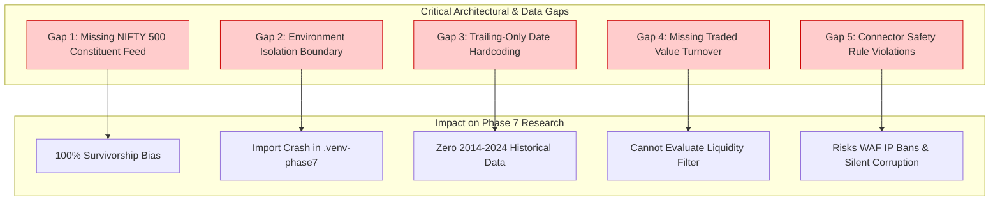

# Phase 7 — Milestone 4.7: NSE 500 Gap Analysis & Technical Remediation Plan

**Repository:** GaurviDEEP
**Working Branch:** `phase7-research`
**Governing Milestone:** Milestone 4.7 (Existing Connector NIFTY 500 Data Acquisition & Safety Audit)
**Execution Timestamp:** 2026-10-10T06:05:00 UTC

---

## 1. Blocker Status Assessment

The results of the Milestone 4.7 existing connector capability audit and pilot attempt directly inform the status of open research blockers:

| Blocker ID | Description | Severity | Pre-Milestone Status | Post-Milestone Status | Capability Code |
|---|---|---|---|---|---|
| **BLK-01** | Absence of Point-in-Time Historical Nifty 500 Constituent Membership | `CRITICAL` | `CONTRACT_READY_REAL_DATA_BLOCKED` | **OPEN / UNRESOLVED** | `STILL_BLOCKED` |
| **BLK-02** | Missing OHLCV Prices and Daily Traded Value (Turnover) for Nifty 500 Universe | `CRITICAL` | `CONTRACT_READY_REAL_DATA_BLOCKED` | **OPEN / UNRESOLVED** | `STILL_BLOCKED` |
| **BLK-04** | Static Sector Classification Lacks Historical Reclassification Timestamps | `REQUIRED_BEFORE_MODELING` | `BLOCKED` | **OPEN / UNRESOLVED** | `STILL_BLOCKED` |

### Detailed Evaluation:
1. **BLK-01:** GaurviDEEP contains no connector capable of retrieving historical index rebalancing circulars, constituent additions, deletions, or effective intervals. The static 138-stock list represents a survivorship-biased snapshot. BLK-01 cannot be resolved from existing connectors.
2. **BLK-02:** While `features/data_provider.py` can fetch trailing daily OHLCV for single active tickers when running in the service environment, it cannot retrieve 10-year historical depth, completely omits traded value turnover in INR, and cannot execute in `.venv-phase7`. BLK-02 remains completely blocked.
3. **BLK-04:** No connector exists for retrieving historical AMFI or NSE sector taxonomy revisions. Static current mappings are prohibited as historical fallbacks. BLK-04 remains blocked.

---

## 2. Technical Gap Breakdown

### Detailed Gap Specifications:
1. **Gap 1 — Missing Constituent Feed:** The application has no module that queries official index reconstitutions. Without historical rebalancing dates, point-in-time universe construction is impossible.
2. **Gap 2 — Environment Isolation Boundary:** `.venv-phase7` is designed for pure quantitative research and machine learning (scikit-learn, lightgbm, statsmodels). It contains no HTTP clients (`requests`, `httpx`). Bringing web-scraping dependencies into `.venv-phase7` risks package conflicts and ABI corruption.
3. **Gap 3 — Trailing-Only Date Hardcoding:** `features/data_provider.py` lines 98–99 compute `end_d = date.today()` and `start_d = end_d - timedelta(days=days)`. The connector cannot be parameterized to fetch fixed historical dates.
4. **Gap 4 — Missing Traded Value Turnover:** NSE's interactive equity quote API returns `chTotTradedQty` (shares), but omits `totalTradedValue` in INR. Calculating turnover as `close * volume` produces a derived approximation, not an exchange-reported value.
5. **Gap 5 — Safety Invariants:** Existing scripts lack exponential backoff, retry ceilings, fail-closed handling on HTTP 403/429, and checksum audit trails.

---

## 3. Technical Remediation Proposals

To resolve these gaps safely without contaminating the production codebase or violating Phase 7 research rules, the owner should choose between two technical remediation paths:

### Path A: Institutional Vendor Procurement (Recommended per Milestone 4.5)
- Procure official point-in-time NIFTY 500 Bhavcopy and constituent history from an authorized vendor (NSE Data & Analytics Limited, Bloomberg, FactSet, or CMIE Prowess).
- **Advantages:** 100% point-in-time compliance, zero survivorship bias, official exchange turnover, 10-year depth, zero web-scraping risks.
- **Next Step:** Owner executes commercial evaluation using [docs/PHASE7_VENDOR_EVALUATION_MATRIX.md](file:///C:/Users/r_chh/OneDrive%20-%20optgbrc/Apps/GaurviDEEP/docs/PHASE7_VENDOR_EVALUATION_MATRIX.md).

### Path B: Formal Ingestion Adapter Milestone (Dedicated Ingestion Environment)
If the owner chooses to build an in-house connector to ingest raw NSE public archives:
1. **Authorize a Separate Ingestion Script:** Create a dedicated ingestion tool running outside `.venv-phase7` (e.g. using the host Python 3.14 environment) that writes strictly to `C:\Users\r_chh\gaurvideep_phase7_staging\nse500\raw\`.
2. **Implement Phase B Safety Standards:**
   - Strict 2-second rate-limiting delay between requests.
   - Max 2 retries with exponential backoff ($2\text{s} \to 4\text{s}$).
   - Immediate termination on HTTP 401, 403, 429, or CAPTCHA.
   - Automatic SHA-256 checksum and rejected-record manifest generation.
3. **Download Full Official Bhavcopy Archives:** Rather than querying individual stock quote APIs, download daily official Bhavcopy archives (`cmDDMMMYYYYbhav.csv.zip` and `sec_bhavdata_full_DDMMYYYY.csv`) from `archives.nseindia.com`. This yields official traded value turnover and deliverable quantities for all listed stocks (including removed/delisted names) in a single daily archive.
4. **Acquire Historical Index Circulars:** Download official semi-annual NIFTY 500 reconstitution circulars from `niftyindices.com` to reconstruct historical constituent addition and deletion intervals.

---

## 4. Milestone 4.8 Existing NSEDataFetcher Remediation Update

Following the owner's authorization of Milestone 4.8, the authoritative `NSEDataFetcher` (`connector_review/nse_data_service.py`) was audited and adapted:
1. **Explicit Historical Range Confirmed:** `NSEDataFetcher.get_historical_data(symbol, start_date, end_date)` implements explicit calendar boundaries, resolving Gap 3 for single-stock history.
2. **Turnover & Volume Reporting:** Upstream payloads report `CH_TOT_TRADED_VAL` and `CH_TOT_TRADED_QTY`. The Phase 7 normalizer strictly avoids deriving turnover from Close.
3. **Safety Remediation Complete:** Built isolated `phase7/sources/` package enforcing sequential locking, minimum 2.0s delay, HTTP denial detection, and zero-retry invariants.
4. **Remaining Unresolved Gaps:**
   - **Gap 1 (Constituents):** `NSEDataFetcher` has no constituent method. `phase7.sources.nse_constituents` returns `SOURCE_UNAVAILABLE`. BLK-01 remains open.
   - **BLK-04 (Sector History):** Point-in-time sector reclassifications are not available.
   - **Live Pilot:** Prepared under `phase7.sources.pilot`, but blocked pending Milestone 4.9 authorization. Status: `NSE_DATA_FETCHER_ADAPTED_LIVE_PILOT_NOT_AUTHORIZED`.
