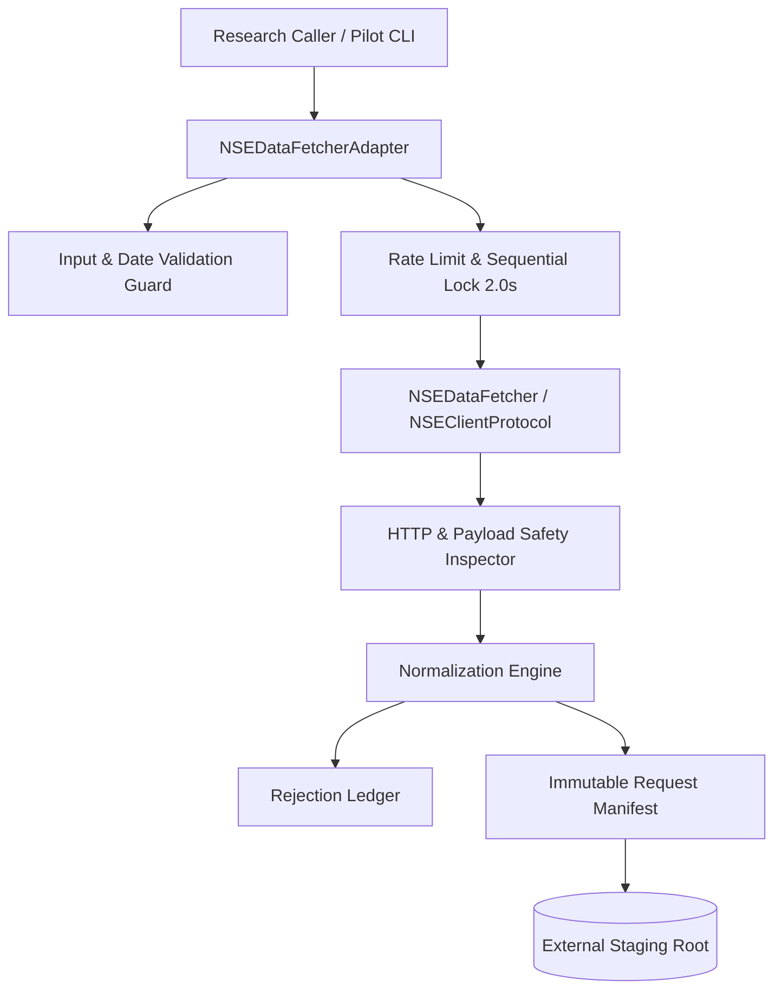

# Phase 7 Specification: Safe NSEDataFetcher Adapter Architecture

## 1. Architectural Overview

The Phase 7 adapter isolates the upstream `NSEDataFetcher` behind strict architectural boundaries, mathematical validation, and fail-closed safety guardrails.



---

## 2. Package Structure (`phase7/sources/`)

| Module | Responsibility | Key Invariants Enforced |
| :--- | :--- | :--- |
| `contracts.py` | Data contracts, enums, protocol definitions | `NSEDataFetcherProtocol`, `FieldStatus`, `CapabilityStatus`, `HistoricalEODRecord` |
| `http_client.py` | Transport safety & denial detection | Rejects 401, 403, 429 without retry; detects CAPTCHA, WAF, HTML; enforces payload size limits |
| `nse_data_fetcher_adapter.py` | Primary fail-closed adapter | Wraps `NSEDataFetcher`; single request lock; 2.0s rate limit; capability discovery; `UNSAFE_FOR_LIVE_PILOT` status |
| `nse_constituents.py` | Index constituent wrapper | Returns `SOURCE_UNAVAILABLE` when fetcher lacks constituent method; labels results `CURRENT_SNAPSHOT_ONLY`; no legacy 138-stock fallback |
| `nse_eod.py` | Historical EOD retrieval entry point | Orchestrates retrieval, normalization, manifest generation, and rejection recording |
| `nse_corporate_actions.py` | Corporate action inspection | Returns `CapabilityStatus.UNAVAILABLE` when fetcher lacks method; avoids inventing adjustment states |
| `normalization.py` | Row normalization & hash computation | Validates OHLC relationships, positive prices, non-negative volume; turnover never inferred from Close; ISIN never inferred |
| `manifest.py` | Request manifest construction | Generates immutable `RequestManifest` with cryptographic SHA-256 checksums |
| `rejections.py` | Malformed symbol/row recording | Logs rejected symbols and invalid rows with reasons and raw payloads |
| `authorization.py` | Single-use authorization marker | Generates and validates immutable markers outside Git; binds staging hash; enforces single-use; atomic consumption |
| `pilot_guard.py` | Pilot pre-flight boundaries | Validates approved 5 symbols (`RELIANCE, TCS, HDFCBANK, INFY, ICICIBANK`), date window (`2024-01-01`..`2024-01-31`), external staging |
| `pilot.py` | Dedicated CLI entry point | Requires `--execute-live` and valid single-use authorization marker; atomic consumption before client creation |
| `audit.py` | Structural quality audit | Audits coverage, nullity, duplicates, and natural key uniqueness |

---

## 3. Protocol & Capability Discovery

The adapter defines `NSEDataFetcherProtocol` to allow complete dependency injection:

```python
@runtime_checkable
class NSEDataFetcherProtocol(Protocol):
    def get_live_quote(self, symbol: str) -> Dict[str, Any]: ...
    def get_market_status(self) -> Dict[str, Any]: ...
    def get_historical_data(self, symbol: str, start: str, end: str) -> List[Dict[str, Any]]: ...
```

The adapter dynamically inspects the underlying client and exposes capability statuses:

| Method | Discovered Status | Rationale |
| :--- | :--- | :--- |
| `get_live_quote` | `AVAILABLE` | Implemented in `NSEDataFetcher` |
| `get_market_status` | `AVAILABLE` | Implemented in `NSEDataFetcher` |
| `get_historical_data` | `AVAILABLE` | Implemented in `NSEDataFetcher` |
| `get_nifty500_constituents`| `UNAVAILABLE` | Not implemented in `NSEDataFetcher` |
| `get_index_constituents` | `UNAVAILABLE` | Not implemented in `NSEDataFetcher` |
| `get_corporate_actions` | `UNAVAILABLE` | Not implemented in `NSEDataFetcher` |
| `get_security_master` | `UNAVAILABLE` | Not implemented in `NSEDataFetcher` |
| `get_sector_classification` | `PARTIAL` | Single-stock live quote metadata only; no point-in-time history |

---

## 4. Input & Boundary Validation

1. **Symbol Hygiene:**
   - Uppercase normalized.
   - Non-empty, alphanumeric with allowed hyphens, underscores, dots, and ampersands (`[A-Z0-9_\-\.&]+`).
   - Maximum length 30 characters.
   - Strict rejection of path traversal (`/`, `\`, `..`), URLs (`?`, `#`, `:`), and control characters (`\x00`, `\n`, `\r`, `\t`).
2. **Date Range Hygiene:**
   - Strict ISO `YYYY-MM-DD` formatting.
   - `start_date <= end_date`.
   - Bounded by Phase 7 development cutoff: `2025-09-16`.

---

## 5. Output Normalization & Field Invariants

The adapter converts raw payloads into canonical `HistoricalEODRecord` instances:

- **Mathematical Consistency:** `open > 0`, `high > 0`, `low > 0`, `close > 0`; `low <= high`; `open` and `close` bounded within `[low, high]`.
- **Non-Inference Rules:**
  - `total_traded_value_inr`: Populated strictly from exchange turnover. Never calculated as `close * volume`. If absent, marked `FieldStatus.NOT_PROVIDED`.
  - `isin`: Preserved if reported; `None` if missing. Never inferred from ticker symbols.
  - `adjustment_state`: Marked `UNADJUSTED` or `UNKNOWN`. Never fabricated.
- **Cryptographic Row Hashes:** Deterministic SHA-256 hash computed over canonical fields.

---

## 6. Safety Status & Live Execution Boundary

The adapter is marked **UNSAFE_FOR_LIVE_PILOT** because:
1. Upstream `NSEDataFetcher` encapsulates HTTP network operations inside internal libraries.
2. Transport-level HTTP 429 status codes and CAPTCHA challenges cannot be reliably caught prior to internal exception handling without internal source remediation.
3. Live requests remain strictly prohibited until Milestone 4.9 authorization.
