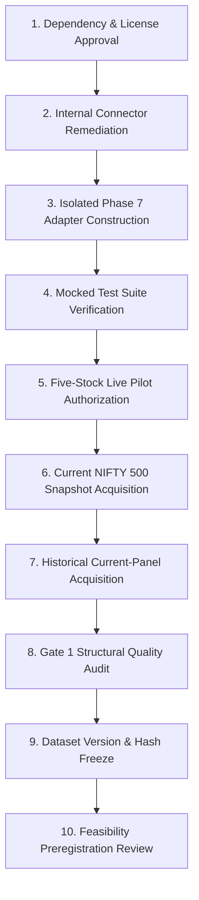

# Phase 7 NSEDataFetcher Phased Integration & Governance Plan

**Document Identifier:** `PHASE7_NSE_DATA_FETCHER_INTEGRATION_PLAN`
**Governing Workstream:** Milestone 4.8 Pre-Integration Roadmap
**Target Integration Engine:** `NSEDataFetcher` (`nse` v4.0.1)
**Integration Status:** `NSE_DATA_FETCHER_SOURCE_AUDITED_INTEGRATION_NOT_AUTHORIZED`
**Milestone 5 Status:** Strictly `BLOCKED`

---

## 1. Executive Summary & Gating Decision

Based on the static source audit, dependency mapping, and security inspection of `connector_review/nse_data_service.py`, integration cannot proceed immediately into live data acquisition.

The project records the following binding gating decisions:
```text
REQUIRES_DEPENDENCY_APPROVAL
REQUIRES_INTERNAL_CONNECTOR_CHANGES
LIVE_PILOT_UNSAFE
```

Live requests and automated integration remain strictly unauthorized until every phase in the ordered sequence below is completed and approved by the project owner.

---

## 2. Ordered Integration Sequence



### Step 1: Dependency & Legal Licensing Approval
- **Objective:** Owner approval of the `nse` package dependency under Python 3.12.10.
- **Licensing Resolution:** Address the GPLv3 copyleft nature of `nse` (v4.0.1 by Benny Thadikaran). Establish clear process boundaries (e.g., dedicated CLI subprocess or microservice isolation) so GaurviDEEP's proprietary modeling codebase is completely safeguarded against copyleft contamination.
- **Verification:** Run `pip check` and confirm zero dependency conflicts.

### Step 2: Internal Connector Remediation
- **Objective:** Patch critical architectural defects in `nse_data_service.py` before linking into production or research pipelines.
- **Required Patches:**
  1. *Eliminate `sys.exit(1)`:* Replace with a standard `ImportError` or custom `DependencyMissingError` so callers can catch and handle missing libraries.
  2. *Enforce Delay >= 2.0s:* Update default `rate_limit_sleep` to `>= 2.0` seconds.
  3. *Enforce External Staging Path:* Prohibit default relative paths `./nse_data`; require explicit configuration to `C:\Users\r_chh\gaurvideep_phase7_staging\nse500\`.
  4. *Atomic Caching:* Implement `.tmp` file writing with atomic `os.replace` and process file locking.
  5. *Timeout Configuration:* Expose socket connect and read timeouts (default: 10.0s).

### Step 3: Isolated Phase 7 Adapter Construction (`phase7/sources/`)
- **Objective:** Build an isolated, fail-closed Phase 7 adapter package without modifying production service code.
- **Modules to Create:**
  - `phase7/sources/contracts.py`: Strict schema dataclasses and status enums.
  - `phase7/sources/nse_data_fetcher_adapter.py`: Protocol wrapper with dependency injection.
  - `phase7/sources/normalization.py`: Conversion of raw responses into canonical Phase 7 contracts.
  - `phase7/sources/manifest.py`: Cryptographic SHA-256 request and dataset ledger.
  - `phase7/sources/pilot.py`: Guardrailed runner restricted to 5 pilot securities and Jan 2024 dates.
- **Boundary Protections:** Zero imports from `features.data_provider`, `features.universe`, `scripts.phase6`, or `service`.

### Step 4: Comprehensive Mocked Test Suite
- **Objective:** Validate all adapter logic, schema parsing, rejection ledgers, and error conditions without issuing network requests.
- **Test Modules:**
  - `tests/phase7/test_nse_data_fetcher_adapter.py`
  - `tests/phase7/test_source_input_validation.py`
  - `tests/phase7/test_source_http_safety.py`
  - `tests/phase7/test_source_eod_normalization.py`
  - `tests/phase7/test_source_manifest.py`
  - `tests/phase7/test_source_isolation.py`
- **Pass Criteria:** 100% pass rate across all mock scenarios.

### Step 5: Separately Authorized Five-Stock Live Pilot
- **Objective:** Controlled empirical verification of real NSE responses against Phase 7 Gate 1 contracts.
- **Pilot Scope:**
  - Symbols: `RELIANCE`, `TCS`, `HDFCBANK`, `INFY`, `ICICIBANK`.
  - Date Range: `2024-01-01` through `2024-01-31`.
  - Rate Limit: Concurrency = 1, delay >= 2.0 seconds.
- **Pass Criteria:** Valid OHLC, explicit traded value status, zero HTTP 401/403/429/CAPTCHA events, valid checksums.
- **Prerequisite:** Explicit owner milestone authorization required.

### Step 6: Current NIFTY 500 Snapshot Acquisition
- **Objective:** Acquire current index constituents.
- **Crucial Finding:** `NSEDataFetcher` contains **zero constituent methods**. A separate approved source (e.g. NSE India CSV index download or NSE XBRL master) must be utilized.
- **Classification:** Strictly labeled `CURRENT_SNAPSHOT_ONLY` (not historical membership).

### Step 7: Historical Current-Panel Acquisition
- **Objective:** Retrieve available historical price history for validated current constituents for the safe supported historical range.
- **Classification:** `CURRENT_PANEL_HISTORICAL_PRICES_SURVIVORSHIP_BIASED`.
- **Storage:** Written exclusively to external staging `C:\Users\r_chh\gaurvideep_phase7_staging\nse500\`. Zero market data committed to Git.

### Step 8: Gate 1 Structural Quality Audit
- **Objective:** Execute full structural quality audit on acquired panel.
- **Audited Metrics:** Missing OHLC, duplicate keys, turnover availability, ISIN coverage, calendar continuity.
- **Blocker Status:** Evaluate whether BLK-01, BLK-02, and BLK-04 can be partially or conditionally progressed.

### Step 9: Dataset Version & Cryptographic Freeze
- **Objective:** Freeze acquired dataset with immutable SHA-256 manifests.
- **Deliverables:** Dataset version manifest, provenance manifest, checksum ledger.

### Step 10: Feasibility Preregistration Review
- **Objective:** Convene formal research review before any consideration of model training.
- **Rule:** Milestone 5 remains strictly BLOCKED until Gate 1 acceptance is formally certified.

---

## 3. Mandatory Governance Guardrails

1. **No Automatic Execution:** The adapter, connector, and live pilot must not run automatically.
2. **Zero Market Data in Repository:** All raw and normalized market data must reside outside Git.
3. **Phase 6 Vault Isolation:** Phase 6 vaults and sealed archives remain completely untouched.
4. **Milestone 5 Prohibition:** Zero model training, zero target generation, and zero performance backtesting authorized.
