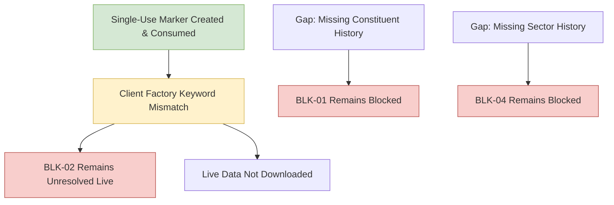

# Phase 7 Gap Analysis: Milestone 4.9 Five-Stock NSE Pilot

## 1. Blocker Status Re-Evaluation

The halt of the Milestone 4.9 live pilot leaves the core research blockers in their formal, fail-closed state:

| Blocker ID | Description | Pre-Milestone Status | Post-Milestone Status | Technical Capability Status |
| :---: | :--- | :--- | :--- | :---: |
| **BLK-01** | Point-in-Time NIFTY 500 Constituent Membership History | `OPEN` | **OPEN / STILL BLOCKED** | `SOURCE_UNAVAILABLE` |
| **BLK-02** | Historical OHLCV Prices and Daily Traded Value (Turnover) | `OPEN` | **OPEN / STILL BLOCKED** | `PILOT_HALTED_ON_SAFETY_CONTROL` |
| **BLK-04** | Point-in-Time Sector Classification History | `OPEN` | **OPEN / STILL BLOCKED** | `SOURCE_UNAVAILABLE` |

### Detailed Assessment:
1. **BLK-01 (PIT Constituents):** `NSEDataFetcher` contains no constituent methods. The adapter strictly classifies constituent retrieval as `SOURCE_UNAVAILABLE`. Survivorship-biased fallbacks remain strictly prohibited.
2. **BLK-02 (Historical OHLCV):** Although `NSEDataFetcher.get_historical_data` supports explicit calendar boundaries in static inspection, real data acquisition has not occurred. The live pilot was halted prior to issuing network requests due to a client factory parameter mismatch (`create_real_nse_client() got an unexpected keyword argument 'data_dir'`). Real OHLCV data remains unprocured.
3. **BLK-04 (Sector Classification):** The data fetcher provides only live snapshot industry tags without historical reclassification timestamps. Point-in-time sector-relative target research remains blocked.

---

## 2. Technical Gap & Defect Analysis

### 2.1 The Reusable Command-Line Authorization Defect (Remediated)
- **Observation:** In Milestone 4.8, `phase7.sources.pilot` mandated `--owner-authorization`.
- **Remediation Completed in Milestone 4.9A:** `phase7/sources/pilot.py` and `phase7/sources/pilot_guard.py` completely removed `--owner-authorization` and all secret phrase comparisons. Implemented single-use scope-bound authorization marker management (`phase7.sources.authorization`) storing markers strictly outside Git and enforcing atomic consumption prior to client instantiation.

### 2.2 Single-Use Authorization Security Architecture
- **No Reusable Secrets:** The marker contains zero passwords, bearer tokens, cookies, or owner phrases.
- **Strict Scope Binding:** Binds milestone 4.9, FIVE_STOCK_NSE_LIVE_PILOT scope, approved 5 symbols in governed order, Jan 2024 dates, 1d interval, and external staging root hash.
- **Atomic Pre-Client Consumption:** Consumed via `os.replace` to `pilot_authorization.consumed.<timestamp>.json` before client initialization. Zero network requests occur if validation or consumption fails.
- **Fail-Closed Guarantees:** Tampering, expiration, reuse, relative paths, or repository locations are rejected.

### 2.3 Re-Authorized Execution Halt: Client Factory Parameter Mismatch
- **Observation:** During the re-authorized execution of Milestone 4.9, the single-use marker was created and atomically consumed. Execution halted immediately during client construction with:
  `TypeError: create_real_nse_client() got an unexpected keyword argument 'data_dir'`
- **Problem:** `phase7/sources/pilot.py` invokes `client_factory(data_dir=str(valid_staging), server_mode=True)`, whereas `create_real_nse_client` in `phase7/sources/client_factory.py` specifies `(download_folder: Path, server: bool = True, timeout: int = 15)`.
- **Safety Impact:** Client initialization failed closed before network socket creation. Exactly zero network requests occurred. Marker remains safely consumed.
- **Required Action:** Authorize a corrective patch to align the client factory calling convention in `phase7/sources/pilot.py` with `phase7/sources/client_factory.py`, followed by fresh marker creation and pilot re-authorization.

---

## 3. Recommended Next Actions

1. **Authorize Corrective Patch:**
   Authorize a corrective maintenance patch to reconcile the factory keyword arguments (`download_folder` vs `data_dir`) between `phase7/sources/pilot.py` and `phase7/sources/client_factory.py`.
2. **Re-authorize Five-Stock Live Pilot:**
   Following the factory signature alignment, request owner re-authorization to create a fresh marker and execute the live pilot.
3. **Milestone 5 Quarantine:**
   Milestone 5 (model training and target generation) remains strictly blocked until real data is procured, ingested, and verified through Gate 1.
