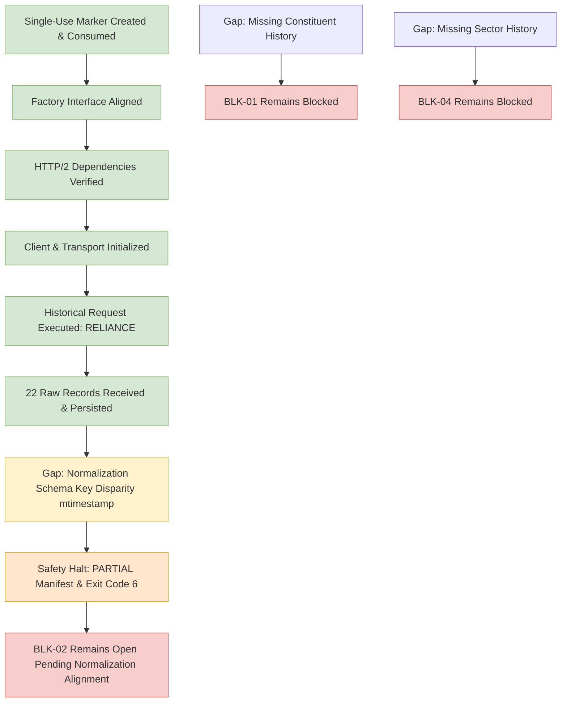

# Phase 7 Gap Analysis: Milestone 4.9 Five-Stock NSE Pilot

## 1. Blocker Status Re-Evaluation

The outcome of the Milestone 4.9 Attempt 4 live pilot execution leaves the core research blockers in their formal, fail-closed state:

| Blocker ID | Description | Pre-Milestone Status | Post-Milestone Status | Technical Capability Status |
| :---: | :--- | :--- | :--- | :--- | :---: |
| **BLK-01** | Point-in-Time NIFTY 500 Constituent Membership History | `OPEN` | **OPEN / STILL BLOCKED** | `SOURCE_UNAVAILABLE` |
| **BLK-02** | Historical OHLCV Prices and Daily Traded Value (Turnover) | `OPEN` | **OPEN / STILL BLOCKED** | `RAW_RETRIEVAL_VERIFIED_SCHEMA_HALT` |
| **BLK-04** | Point-in-Time Sector Classification History | `OPEN` | **OPEN / STILL BLOCKED** | `SOURCE_UNAVAILABLE` |

### Detailed Assessment:
1. **BLK-01 (PIT Constituents):** `NSEDataFetcher` contains no constituent methods. The adapter strictly classifies constituent retrieval as `SOURCE_UNAVAILABLE`. Survivorship-biased fallbacks remain strictly prohibited.
2. **BLK-02 (Historical OHLCV):** Upstream retrieval is now **proven functional in production**: 22 trading session records for RELIANCE were successfully retrieved over HTTP/2, verified safe, and written to external staging (`raw/historical/RELIANCE_...json`). However, normalized records were not produced due to key casing mismatch in `phase7/sources/normalization.py` (`mtimestamp` vs `mTIMESTAMP`). BLK-02 remains formally open until normalized, accepted records pass Gate 1.
3. **BLK-04 (Sector Classification):** The data fetcher provides only live snapshot industry tags without historical reclassification timestamps. Point-in-time sector-relative target research remains blocked.

---

## 2. Technical Gap & Defect Analysis

### 2.1 Historical Retrieval Pipeline Wiring (Verified in Attempt 4)
- **Pipeline Wiring:** The sequential loop, single active request lock, 2.0s pacing, atomic raw persistence, manifest lifecycle, row conservation rule, and finally-block client closure were successfully executed.
- **Evidence:** Real payload retrieved and saved to:
  `C:\Users\r_chh\gaurvideep_phase7_staging\nse500\pilot_4_9\raw\historical\RELIANCE_2024-01-01_2024-01-31_1d_20261010T081014Z_59af0e39.json`
- **Integrity:** SHA-256 hash `59af0e392d7bb9073a49603115e11150a8adbab59e0619c6a0608d19ffcbef63`. Zero repository files touched.

### 2.2 Attempt 4 Finding: Upstream Schema Key Disparity in `normalization.py`
- **Observation:** `nse==4.0.1` returned a JSON list of dictionaries with specific keys:
  - Timestamp: `'mtimestamp'` containing dates like `'01-Jan-2024'`.
  - Prices: `'chOpeningPrice'`, `'chTradeHighPrice'`, `'chTradeLowPrice'`, `'chClosingPrice'`.
  - Volumes & Value: `'chTotTradedQty'`, `'chTotTradedVal'`, `'chTotalTrades'`, `'vwap'`.
  - Identifiers: `'chSymbol'`, `'chSeries'`.
- **Mismatch:** `phase7/sources/normalization.py` checked uppercase / canonical keys (`CH_TIMESTAMP`, `mTIMESTAMP`, `date`, `Date`, `trading_date`). It did not map lowercase `'mtimestamp'`.
- **Impact:** All 22 raw records raised `ValueError("Missing trading date in row payload")` and were rejected.
- **Safety Enforcement:** The pilot adhered to the 5-stock protocol: `rej_count > 0` triggered a safety halt with status `PARTIAL`. Subsequent symbols were not queried, the client closed cleanly, and exit code 6 was returned.

---

## 3. Recommended Next Actions

1. **Authorize Milestone 4.9E Schema Normalization Alignment:**
   Authorize a code modification to `phase7/sources/normalization.py` to support the exact field naming convention returned by `nse==4.0.1`:
   - Map `mtimestamp` to `trading_date` (parse `%d-%b-%Y`).
   - Map `chOpeningPrice` to `open_price`.
   - Map `chTradeHighPrice` to `high_price`.
   - Map `chTradeLowPrice` to `low_price`.
   - Map `chClosingPrice` to `close_price`.
   - Map `chTotTradedQty` to `volume`.
   - Map `chTotTradedVal` to `turnover`.
   - Map `chTotalTrades` to `total_trades`.
   - Map `vwap` to `vwap`.
   - Map `chSeries` to `series`.
   - Map `chSymbol` to `symbol`.
2. **Offline Contract & Unit Testing:**
   Add unit test fixtures using the exact observed RELIANCE raw dictionary payload. Confirm 22/22 rows normalize deterministically without rejections.
3. **Re-authorize Five-Stock Live Pilot:**
   Following the schema alignment patch, request owner re-authorization (`RE-AUTHORIZE MILESTONE 4.9 AFTER NORMALIZATION SCHEMA FIX`) to create a fresh marker and execute the live pilot.
4. **Milestone 5 Quarantine:**
   Milestone 5 (model training and target generation) remains strictly blocked until real data is procured, normalized, and accepted through Gate 1.
5. **Blockers BLK-01, BLK-02, and BLK-04:**
   Remain formally OPEN until authentic point-in-time constituent, price-turnover, and sector history data are procured and accepted.
