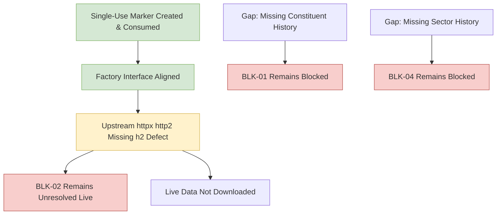

# Phase 7 Gap Analysis: Milestone 4.9 Five-Stock NSE Pilot

## 1. Blocker Status Re-Evaluation

The halt of the Milestone 4.9 live pilot leaves the core research blockers in their formal, fail-closed state:

| Blocker ID | Description | Pre-Milestone Status | Post-Milestone Status | Technical Capability Status |
| :---: | :--- | :--- | :--- | :---: |
| **BLK-01** | Point-in-Time NIFTY 500 Constituent Membership History | `OPEN` | **OPEN / STILL BLOCKED** | `SOURCE_UNAVAILABLE` |
| **BLK-02** | Historical OHLCV Prices and Daily Traded Value (Turnover) | `OPEN` | **OPEN / STILL BLOCKED** | `PILOT_HALTED_ON_SAFETY_CONTROL` |
| **BLK-04** | Point-in-Time Sector Classification History | `OPEN` | **OPEN / STILL BLOCKED** | `SOURCE_UNAVAILABLE` |

### Detailed Assessment:
1. **BLK-01 (PIT Constituents):** `NSEDataFetcher` contains no constituent methods. The adapter strictly classifies constituent retrieval as `SOURCE_UNAVAILABLE`. Survivorship-biased fallbacks remain strictly prohibited.
2. **BLK-02 (Historical OHLCV):** Although `NSEDataFetcher.get_historical_data` supports explicit calendar boundaries in static inspection, real data acquisition has not occurred. During Attempt 2 post factory alignment, the live pilot halted prior to issuing network requests due to an upstream dependency defect in `nse==4.0.1` (`Using http2=True, but the 'h2' package is not installed. Make sure to install httpx using 'pip install httpx[http2]'`). Real OHLCV data remains unprocured.
3. **BLK-04 (Sector Classification):** The data fetcher provides only live snapshot industry tags without historical reclassification timestamps. Point-in-time sector-relative target research remains blocked.

---

## 2. Technical Gap & Defect Analysis

### 2.1 Factory Interface Parameter Alignment (Completed in Milestone 4.9B)
- **Problem in Attempt 1:** `phase7/sources/pilot.py` invoked `client_factory(data_dir=..., server_mode=...)`, raising `TypeError` against `create_real_nse_client`.
- **Resolution in Milestone 4.9B:** Canonical factory interface `create_real_nse_client(download_folder: Path, server: bool = True, timeout: int = 15) -> NSEClientProtocol` and `NSEClientFactoryProtocol` were implemented. In Attempt 2, `pilot.py` cleanly passed canonical keywords.

### 2.2 Upstream Dependency Defect: `httpx[http2]` (Remediated in Milestone 4.9C)
- **Observation:** In Attempt 2, the fresh single-use marker was atomically consumed. Client initialization reached `nse.NSE.__init__`, which internally initialized `httpx.Client(http2=True)`.
- **Failure:** `httpx` raised `PILOT VALIDATION ERROR: Using http2=True, but the 'h2' package is not installed. Make sure to install httpx using 'pip install httpx[http2]'`.
- **Remediation Completed in Milestone 4.9C:**
  1. Updated `requirements-phase7.txt` to `nse[server]==4.0.1`.
  2. Installed HTTP/2 runtime packages: `h2==4.4.1`, `hpack==4.2.0`, `hyperframe==6.1.0`. Maintained `httpx==0.28.1` and `nse==4.0.1`.
  3. Pre-flight client construction test confirmed `create_real_nse_client(server=True, timeout=15)` instantiates and closes without error under network interception: `CLIENT_CONSTRUCTION_SUCCEEDED_ZERO_NETWORK_REQUESTS`.
  4. Added regression test suite `tests/phase7/test_source_runtime_dependencies.py`.

---

## 3. Recommended Next Actions

1. **Re-authorize Five-Stock Live Pilot:**
   Following HTTP/2 dependency resolution in Milestone 4.9C, request owner re-authorization (`RE-AUTHORIZE MILESTONE 4.9 AFTER HTTP2 DEPENDENCY FIX`) to create a fresh single-use marker outside Git and execute the live pilot.
2. **Milestone 5 Quarantine:**
   Milestone 5 (model training and target generation) remains strictly blocked until real data is procured, ingested, and verified through Gate 1.
3. **Blockers BLK-01, BLK-02, and BLK-04:**
   Remain formally OPEN until authentic point-in-time constituent, price-turnover, and sector history data are procured and accepted.
