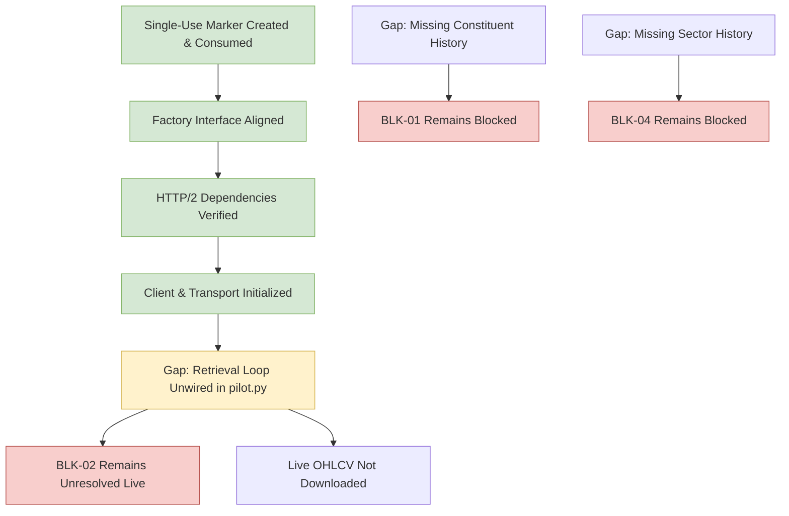

# Phase 7 Gap Analysis: Milestone 4.9 Five-Stock NSE Pilot

## 1. Blocker Status Re-Evaluation

The outcome of the Milestone 4.9 live pilot execution leaves the core research blockers in their formal, fail-closed state:

| Blocker ID | Description | Pre-Milestone Status | Post-Milestone Status | Technical Capability Status |
| :---: | :--- | :--- | :--- | :---: |
| **BLK-01** | Point-in-Time NIFTY 500 Constituent Membership History | `OPEN` | **OPEN / STILL BLOCKED** | `SOURCE_UNAVAILABLE` |
| **BLK-02** | Historical OHLCV Prices and Daily Traded Value (Turnover) | `OPEN` | **OPEN / STILL BLOCKED** | `PILOT_FAILED_INCOMPLETE_RETRIEVAL` |
| **BLK-04** | Point-in-Time Sector Classification History | `OPEN` | **OPEN / STILL BLOCKED** | `SOURCE_UNAVAILABLE` |

### Detailed Assessment:
1. **BLK-01 (PIT Constituents):** `NSEDataFetcher` contains no constituent methods. The adapter strictly classifies constituent retrieval as `SOURCE_UNAVAILABLE`. Survivorship-biased fallbacks remain strictly prohibited.
2. **BLK-02 (Historical OHLCV):** Although `NSEDataFetcher.get_historical_data` supports explicit calendar boundaries in static inspection and the client initialized over HTTP/2, real historical data was not acquired. `phase7.sources.pilot` terminated at Step 14 without invoking the per-symbol retrieval pipeline. Real OHLCV data remains unprocured.
3. **BLK-04 (Sector Classification):** The data fetcher provides only live snapshot industry tags without historical reclassification timestamps. Point-in-time sector-relative target research remains blocked.

---

## 2. Technical Gap & Defect Analysis

### 2.1 Factory Interface & HTTP/2 Runtime Dependencies (Resolved)
- **Factory Interface Alignment:** Canonical factory signature `create_real_nse_client(download_folder: Path, server: bool = True, timeout: int = 15) -> NSEClientProtocol` and `NSEClientFactoryProtocol` were implemented in Milestone 4.9B.
- **HTTP/2 Runtime Dependency Resolution:** `requirements-phase7.txt` was updated to `nse[server]==4.0.1` in Milestone 4.9C. `h2==4.4.1`, `hpack==4.2.0`, and `hyperframe==6.1.0` resolved cleanly.
- **Verification:** In Attempt 3, `create_real_nse_client` executed without error, successfully contacting the option-chain endpoint over HTTP/2 and saving session cookies (`nse_cookies_httpx.json`) in staging.

### 2.2 Attempt 3 Finding: Unwired Symbol Retrieval Pipeline in `pilot.py`
- **Observation:** `phase7/sources/pilot.py` completed client initialization (Step 14) and exited with code 0 without executing the per-symbol retrieval, normalization, manifest generation, and rate limiting loop.
- **Impact:** 0 of 5 securities were retrieved; date coverage was 0.0%. Acceptance criteria failed.
- **Safety Guarantee:** No repository files were modified; no unverified data was saved; the single-use marker remains safely consumed.

---

## 3. Recommended Next Actions

1. **Wire Per-Symbol Retrieval Pipeline in `pilot.py`:**
   Authorize a corrective maintenance patch to wire the sequential symbol retrieval loop into `run_pilot()`, integrating `NSEDataFetcherAdapter` or client retrieval, 2.0s rate limiting, normalization, and manifest staging.
2. **Re-authorize Five-Stock Live Pilot:**
   Following the pipeline wiring patch, request explicit owner re-authorization (`RE-AUTHORIZE MILESTONE 4.9 AFTER RETRIEVAL WIRING`) to create a fresh marker and execute the live pilot.
3. **Milestone 5 Quarantine:**
   Milestone 5 (model training and target generation) remains strictly blocked until real data is procured, ingested, and verified through Gate 1.
4. **Blockers BLK-01, BLK-02, and BLK-04:**
   Remain formally OPEN until authentic point-in-time constituent, price-turnover, and sector history data are procured and accepted.
