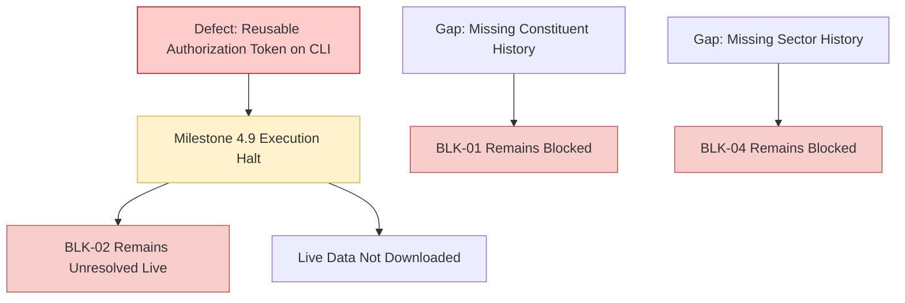

# Phase 7 Gap Analysis: Milestone 4.9 Five-Stock NSE Pilot

## 1. Blocker Status Re-Evaluation

The halt of the Milestone 4.9 live pilot leaves the core research blockers in their formal, fail-closed state:

| Blocker ID | Description | Pre-Milestone Status | Post-Milestone Status | Technical Capability Status |
| :---: | :--- | :--- | :--- | :---: |
| **BLK-01** | Point-in-Time NIFTY 500 Constituent Membership History | `OPEN` | **OPEN / STILL BLOCKED** | `SOURCE_UNAVAILABLE` |
| **BLK-02** | Historical OHLCV Prices and Daily Traded Value (Turnover) | `OPEN` | **OPEN / STILL BLOCKED** | `PILOT_HALTED_ON_SAFETY_CONTROL` |
| **BLK-04** | Point-in-Time Sector Classification History | `OPEN` | **OPEN / STILL BLOCKED** | `SOURCE_UNAVAILABLE` |

### Detailed Assessment:
1. **BLK-01 (PIT Constituents):** `NSEDataFetcher` contains no constituent methods. The adapter strictly classifies constituent retrieval as `SOURCE_UNAVAILABLE`. Survivorship-biased fallbacks remain strictly prohibited.
2. **BLK-02 (Historical OHLCV):** Although `NSEDataFetcher.get_historical_data` supports explicit calendar boundaries in static inspection, real data acquisition has not occurred. The live pilot was halted prior to issuing network requests due to the CLI reusable-token requirement defect. Real OHLCV data remains unprocured.
3. **BLK-04 (Sector Classification):** The data fetcher provides only live snapshot industry tags without historical reclassification timestamps. Point-in-time sector-relative target research remains blocked.

---

## 2. Technical Gap & Defect Analysis



### 2.1 The Reusable Command-Line Authorization Defect
- **Observation:** In Milestone 4.8, `phase7.sources.pilot` was written with:
  ```python
  if execute_live:
      if owner_authorization != REQUIRED_PILOT_PHRASE:
          raise PermissionError(...)
  ```
- **Problem:** This design required the owner authorization phrase to be stored as a CLI argument string (`--owner-authorization "..."`), functioning as a reusable token.
- **Milestone 4.9 Instruction:** The owner explicitly directed that the phrase must not be supplied on the command line, and that the agent must halt if the code still mandates it.
- **Remediation Required:** A dedicated maintenance patch must update `phase7/sources/pilot.py` to decouple live execution from command-line string matching, allowing authorized command execution via explicit execution context.

---

## 3. Recommended Next Actions

1. **Commit Pilot Blocker Documentation:**
   Commit the authorized documentation under:
   `docs(phase7): record five-stock NSE pilot blocker`
2. **Authorize Corrective Patch:**
   Request owner authorization to patch `phase7/sources/pilot.py` and associated test fixtures to remove the reusable CLI authorization token requirement.
3. **Re-authorize Five-Stock Pilot:**
   Following the corrective patch, re-execute the five-stock live pilot in clean staging under Milestone 4.9.
4. **Milestone 5 Quarantine:**
   Milestone 5 (model training and target generation) remains strictly blocked until real data is procured, ingested, and verified through Gate 1.
