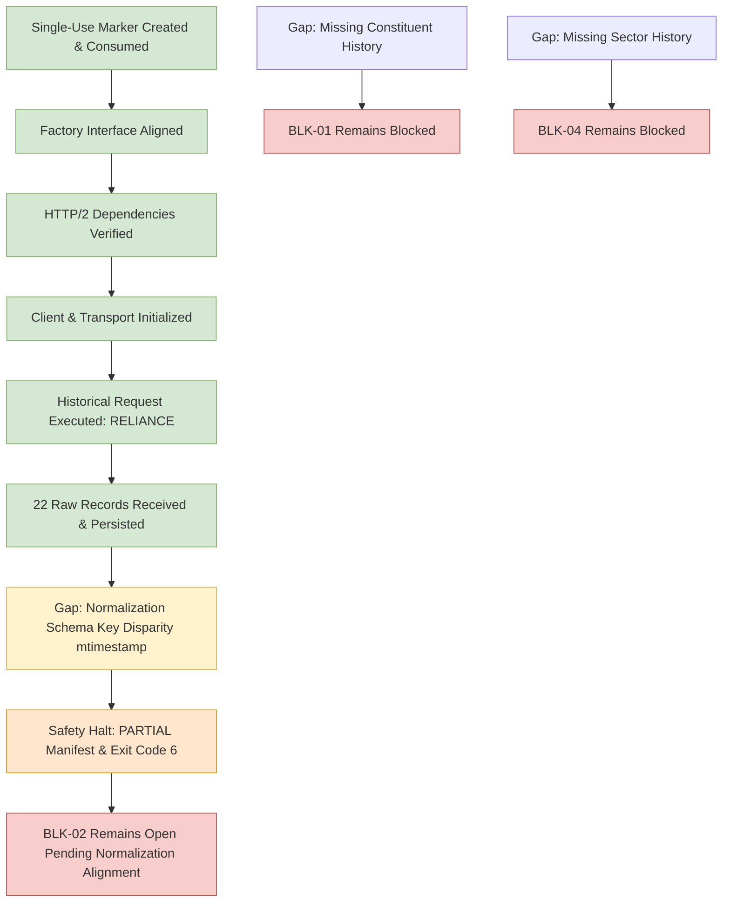

# Phase 7 Gap Analysis: Milestone 4.9 Five-Stock NSE Pilot

## 1. Blocker Status Re-Evaluation

Following the successful execution and closure of the Milestone 4.9 Five-Stock NSE Live Pilot (Attempt 5 post schema alignment), the core research blockers stand as follows:

| Blocker ID | Description | Pre-Milestone Status | Post-Milestone Status | Technical Capability Status |
| :---: | :--- | :--- | :--- | :--- | :---: |
| **BLK-01** | Point-in-Time NIFTY 500 Constituent Membership History | `OPEN / STILL_BLOCKED` | **STILL_BLOCKED** | `SOURCE_UNAVAILABLE` |
| **BLK-02** | Historical OHLCV Prices and Daily Traded Value (Turnover) | `OPEN / STILL_BLOCKED` | **PILOT_CAPABILITY_CONFIRMED_GATE1_NOT_PASSED** | `LIVE_RETRIEVAL_AND_NORMALIZATION_PROVEN_PILOT_SAMPLE_ONLY` |
| **BLK-04** | Point-in-Time Sector Classification History | `OPEN / STILL_BLOCKED` | **STILL_BLOCKED** | `SOURCE_UNAVAILABLE` |

### Detailed Assessment:
1. **BLK-01 (PIT Constituents):** `NSEDataFetcher` contains no constituent methods. The adapter strictly classifies constituent retrieval as `SOURCE_UNAVAILABLE`. Survivorship-biased fallbacks remain strictly prohibited. Status: **STILL_BLOCKED**.
2. **BLK-02 (Historical OHLCV):** Upstream retrieval and normalization are now **proven fully functional in production**: All 5 authorized stocks (`RELIANCE`, `TCS`, `HDFCBANK`, `INFY`, `ICICIBANK`) were successfully retrieved over HTTP/2, normalized under `NSE_4_0_1_HISTORICAL_CAMELCASE_V1`, cryptographically verified, and persisted outside Git (110 rows, 0 rejected, 100% coverage). The sample is classified strictly as `FIVE_STOCK_LIVE_CAPABILITY_SAMPLE_NOT_RESEARCH_DATASET`. Gate 1 real-data evaluation across the full historical cross-section is NOT passed. Status: **PILOT_CAPABILITY_CONFIRMED_GATE1_NOT_PASSED**.
3. **BLK-04 (Sector Classification):** The data fetcher provides only live snapshot industry tags without historical reclassification timestamps. Point-in-time sector-relative target research remains blocked. Status: **STILL_BLOCKED**.

---

## 2. Technical Gap & Defect Analysis

### 2.1 Historical Retrieval Pipeline Wiring (Verified in Attempt 4)
- **Pipeline Wiring:** The sequential loop, single active request lock, 2.0s pacing, atomic raw persistence, manifest lifecycle, row conservation rule, and finally-block client closure were successfully executed.
- **Evidence:** Real payload retrieved and saved to:
  `C:\Users\r_chh\gaurvideep_phase7_staging\nse500\pilot_4_9\raw\historical\RELIANCE_2024-01-01_2024-01-31_1d_20261010T081014Z_59af0e39.json`
- **Integrity:** SHA-256 hash `59af0e392d7bb9073a49603115e11150a8adbab59e0619c6a0608d19ffcbef63`. Zero repository files touched.

### 2.2 Attempt 4 Finding: Upstream Schema Key Disparity in `normalization.py`
- **Observation:** `nse==4.0.1` returned a JSON list of dictionaries with specific keys:
  - Timestamp: `'mtimestamp'` containing dates like `'01-Jan-2024'`.
  - Prices: `'chOpeningPrice'`, `'chTradeHighPrice'`, `'chTradeLowPrice'`, `'chClosingPrice'`.
  - Volumes & Value: `'chTotTradedQty'`, `'chTotTradedVal'`, `'chTotalTrades'`, `'vwap'`.
  - Identifiers: `'chSymbol'`, `'chSeries'`.
- **Mismatch:** `phase7/sources/normalization.py` checked uppercase / canonical keys (`CH_TIMESTAMP`, `mTIMESTAMP`, `date`, `Date`, `trading_date`). It did not map lowercase `'mtimestamp'`.
- **Impact:** All 22 raw records raised `ValueError("Missing trading date in row payload")` and were rejected.
- **Safety Enforcement:** The pilot adhered to the 5-stock protocol: `rej_count > 0` triggered a safety halt with status `PARTIAL`. Subsequent symbols were not queried, the client closed cleanly, and exit code 6 was returned.

---

## 3. Recommended Next Actions

1. **Milestone 4.9 Five-Stock Live Pilot Closure (COMPLETED):**
   Live pilot Attempt 5 executed with 100% success across all 5 symbols (`RELIANCE`, `TCS`, `HDFCBANK`, `INFY`, `ICICIBANK`), producing 110 normalized rows, 0 rejected rows, 0 duplicate keys, and 100% date coverage in January 2024. Status: `NSE_FIVE_STOCK_PILOT_CLOSED_SUCCESSFULLY`.
2. **Governed Dataset Classification:**
   The acquired data is classified strictly as `FIVE_STOCK_LIVE_CAPABILITY_SAMPLE_NOT_RESEARCH_DATASET`. Under strict governance rules, this pilot data is NOT survivorship-free, NOT a point-in-time NIFTY 500 panel, DOES NOT pass Gate 1, is NOT production-ready, DOES NOT constitute validated alpha, is NOT suitable for model training, and DOES NOT provide evidence of investment performance.
3. **Milestone 5 Quarantine:**
   Milestone 5 (model training and target generation) remains strictly blocked until authentic point-in-time universe data is procured, normalized, and accepted through Gate 1.
4. **Blocker Status Registry:**
   - BLK-01: `STILL_BLOCKED`
   - BLK-02: `PILOT_CAPABILITY_CONFIRMED_GATE1_NOT_PASSED`
   - BLK-04: `STILL_BLOCKED`
5. **Next Authorized Milestone:**
   `MILESTONE 4.10A: CURRENT NIFTY 500 CONSTITUENT SNAPSHOT PILOT` (Governed static audit and capability evaluation for acquiring official current NIFTY 500 constituent symbols).
