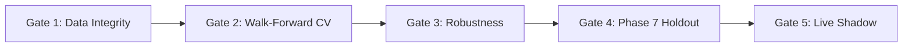

# Phase 7 Binding Research Preregistration

**Repository:** GaurviDEEP
**Working Branch:** `phase7-research`
**Base Commit Checkpoint:** `c978968ec822aa20453920c8708673fcaa736695`
**Phase 6 Closure Tag:** `phase6-closed-2026-10-04`
**Effective Date:** 2026-10-05
**Version:** 1.0.0 (Frozen Preregistration)
**Standard Environment:** Python 3.12 (`.venv-phase7`)

---

## 1. Primary & Secondary Research Questions

### Primary Research Question
> **Can GaurviDEEP rank liquid Indian equities by expected 20-trading-day sector-relative return with sufficient stability to create a diversified, tradable long-only portfolio after realistic transaction costs?**

### Secondary Research Question
> **Can a medium-horizon (60-trading-day) beta-adjusted market-residual ranking signal provide orthogonal alpha or exposure-stabilizing value to the primary sector-relative portfolio?**

Predictions must be **cross-sectional ranks or percentile scores**, never categorical BUY or SELL trading recommendations. The 200-SMA regime state serves strictly as an exposure-control / risk-overlay comparison, not proof of stock-picking alpha.

---

## 2. Mathematical Target Formulations & Execution Alignment

### 2.1 Primary Target: 20-Day Sector-Relative Return
For security $i$ belonging to sector $S(i)$ at decision date $t$:
$$\text{target\_20d\_sector\_relative}_{i, t} = R_{i}(t+1 \to t+20) - R_{S(i)}(t+1 \to t+20)$$
Where:
- $R_{i}(t+1 \to t+20) = \frac{P_{i, t+20}^{\text{exec}} - P_{i, t+1}^{\text{exec}}}{P_{i, t+1}^{\text{exec}}} + \text{Dividend Yield Adjustment}$
- $R_{S(i)}(t+1 \to t+20) = \text{Equal-weighted or market-cap-weighted benchmark total return of active sector } S(i) \text{ from } t+1 \to t+20$
- $P^{\text{exec}}$ denotes the executable price at the corresponding session (Open or volume-weighted average price, never same-day Close $P_t$).

### 2.2 Secondary Target: 60-Day Beta-Adjusted Residual Return
$$\text{target\_60d\_residual}_{i, t} = R_{i}(t+1 \to t+60) - \hat{\beta}_{i, t} \cdot R_{\text{market}}(t+1 \to t+60)$$
Where:
- $\hat{\beta}_{i, t}$ is estimated exclusively on data available at or before date $t$ (e.g. 252-day trailing rolling OLS against Nifty 50 or Nifty 500 total return).
- $R_{\text{market}}(t+1 \to t+60)$ is the broad market total return over the 60-trading-day horizon.

### 2.3 Strict $t+1$ Execution Mandate
- **Zero Same-Day Closing Execution:** No trade may assume execution at the closing price of prediction date $t$ unless verified timestamped signal generation before the market close is proven.
- **Primary Execution Assumption:** Next-session executable price ($t+1$ open or volume-weighted execution).
- **Target Isolation:** Target columns and future returns must **never** enter feature matrices. Target generation must be physically isolated in `phase7/targets/engine.py`.

---

## 3. Investable Universe & Point-in-Time Eligibility Rules

### 3.1 Universe Specification
- **Base Universe:** Point-in-Time liquid **Nifty 500** universe reconstructed independently on each historical rebalance date $t$.
- **Anti-Survivorship Mandate:** Modern index membership cannot be projected backward retrospectively. Historical additions and deletions must be applied strictly on their circular effective dates.
- **Fail-Closed Principle:** If the point-in-time constituent status, publication timestamp, or corporate action status of a security on date $t$ is unknown or ambiguous, the security is **excluded** (`NOT_IN_PIT_UNIVERSE`). Unknown data is never approximated or backfilled with future state.

### 3.2 Quantitative Eligibility Filters
On each rebalance date $t$, an ordinary equity share is eligible for ranking if and only if:
1. **Exchange Listing:** NSE-listed ordinary equity share (Series EQ).
2. **Minimum Price:** Adjusted closing price $P_{i, t} \ge \text{INR } 20.00$.
3. **Trading History:** At least 252 prior consecutive trading days of valid market history.
4. **Liquidity Threshold:** 60-trading-day median daily traded value (MDTV) $\ge \text{INR } 10\text{ crore}$ ($100,000,000\text{ INR}$).
5. **Corporate Action Integrity:** Valid adjustment factors for splits, bonuses, and rights issues are resolved.
6. **Sector Mapping:** Valid point-in-time AMFI/NSE sector classification is present.
7. **Trading Status:** Not suspended, barred, under surveillance (ASM/GSM Stage III+), or subject to prolonged non-trading.
8. **Financial Institutions Policy:** Banks, NBFCs, and insurance firms are excluded from the initial general accounting/valuation model iteration due to structural differences in financial reporting, unless sector-specific banking accounting transforms are preregistered.

---

## 4. Feature Family Scope

### 4.1 Permitted Initial Feature Families
1. **Medium-Term Momentum:**
   - 12-month return excluding the most recent month ($t-252 \to t-21$).
   - 6-month sector-relative momentum ($t-126 \to t-1$).
   - 3-month residual momentum ($t-63 \to t-1$).
   - Distance from 52-week high: $\frac{P_{i, t} - \max_{252}(P_i)}{\max_{252}(P_i)}$.
   - Momentum consistency: Fraction of positive monthly returns over trailing 12 months.
   - Volume-confirmed momentum: Price momentum scaled by volume trend.
2. **Exchange Corporate Fundamentals (SUE):**
   - Standardized Unexpected Earnings (`sue`) from machine-readable NSE XBRL filings with audited broadcast timestamps strictly preceding date $t$.
   - Year-over-year split-adjusted quarterly EPS delta.
3. **Point-in-Time Quality & Valuation (Gated on Verified Data):**
   - ROCE, Incremental ROCE, OCF/PAT, Free-cash-flow margin.
   - Receivables growth vs revenue growth, Inventory growth vs revenue growth.
   - Interest coverage, Net debt to EBITDA, Gross-margin stability, Share dilution.
   - Sector-relative valuation percentiles (Earnings Yield, FCF Yield, EV/EBITDA, P/B for financials).
   - *Requirement:* Must possess verified publication timestamps (`first_seen_timestamp`).

### 4.2 Formally Deferred Feature Families (Require Future Amendments)
The following families are formally deferred and **must not be used** in initial Phase 7 model iterations:
- Historical analyst consensus estimates and forward earnings revisions (BLK-05).
- Corporate-announcement NLP and sentiment intelligence (BLK-08).
- Management-guidance extraction from call transcripts.
- Promoter holding changes and insider pledging tracking.
- Any unverified fundamental balance sheet or cash flow feed lacking point-in-time broadcast records.
- **Uncontrolled technical indicators** (e.g. RSI, MACD, Stochastics, Williams %R, Aroon) are prohibited.

---

## 5. Model Family Hierarchy & Architecture Constraints

Candidate models must be evaluated strictly in hierarchical order from simplest to most complex:

```
[1. Non-ML Baselines] ──► [2. Linear Models] ──► [3. Tree Regressors] ──► [4. Ranking Models]
```

1. **Non-ML Baselines:**
   - Equal-weight eligible universe benchmark.
   - Sector-neutral equal-weight universe.
   - Cross-sectional 12-minus-1 momentum ranking.
   - Simple quality composite (SUE).
   - Multi-factor momentum-quality-valuation composite.
   - 200-SMA regime filter as an exposure-control benchmark.
2. **Linear Models:**
   - Ridge Regression ($L_2$ regularized).
   - Elastic Net ($L_1 + L_2$ regularized).
3. **Tree Regressors:**
   - Constrained LightGBM regressor (`max_depth <= 4`, `num_leaves <= 15`).
   - Constrained XGBoost regressor (`max_depth <= 3`, subsample $\le 0.8$).
4. **Ranking Models:**
   - LightGBM LambdaRank (`objective='lambdarank'`).
   - XGBoost pairwise ranking (`objective='rank:pairwise'`).

### Prohibited Architectures
LSTMs, Transformers, Recurrent Neural Networks, Deep Ranking Networks, and Reinforcement Learning are **strictly prohibited** during the initial Phase 7 research programme. If a simpler model achieves predictive and economic performance within statistical tolerance of a more complex model, the simpler model must be selected (Occam's razor).

---

## 6. Walk-Forward Validation Protocol & Leakage Controls

### 6.1 Validation Structure
- **Architecture:** Expanding Walk-Forward Validation across at least **10 sequential windows**.
- **Purge Interval:**
  - Primary target ($20\text{d}$): Minimum **20 trading days** purge gap between training and validation periods.
  - Secondary target ($60\text{d}$): Minimum **60 trading days** purge gap.
- **Embargo Interval:**
  - Primary target: Minimum **5 trading days** post-validation embargo.
  - Secondary target: Minimum **10 trading days** post-validation embargo.

### 6.2 Fold-Local Preprocessing Mandate
- All scaling (StandardScaler, RobustScaler), winsorization (e.g. 1st/99th percentiles), imputation, cross-sectional ranking, feature selection, and hyperparameter tuning must be **fitted strictly inside each training fold**.
- Applying transformations or normalizations across full multi-year series prior to time-splitting is a critical governance violation.

---

## 7. Portfolio Construction, Risk Constraints & Transaction Costs

### 7.1 Primary Research Portfolio Rules
- **Type:** Long-only portfolio.
- **Constituent Count:** Top 20 ranked eligible stocks.
- **Rebalance Frequency:** Weekly (every Monday or first subsequent trading day).
- **Primary Allocation:** Equal-weight ($5.00\%$ initial target weight per stock).
- **Secondary Comparison:** Predefined volatility-controlled allocation.
- **Individual Stock Cap:** $\le 500\text{ basis points}$ ($5.00\%$ maximum initial weight).
- **Sector Exposure Cap:** $\le 2500\text{ basis points}$ ($25.00\%$ maximum total sector exposure).
- **Leverage:** Zero ($1.0\times$ max exposure).
- **Short Selling:** Prohibited.
- **Minimum Holding Period:** 20 trading days (unless stopped out by a preregistered risk rule).

### 7.2 Staged Transaction-Cost Scenarios
Portfolio performance must be evaluated across three integer basis-point scenarios:
1. **Base Case:** **25 basis points** round-trip ($0.25\%$).
2. **Conservative Case:** **50 basis points** round-trip ($0.50\%$).
3. **Stress Case:** **75 basis points** round-trip ($0.75\%$).

The cost engine must explicitly model: Brokerage, STT, Exchange transaction charges, Clearing fees, GST, SEBI turnover fees, Stamp duty, Bid-ask spread, and Market impact.

### 7.3 Liquidity & Capacity Limits
- **Max Trade Size:** An assumed single-rebalance trade cannot exceed **500 basis points** ($5.00\%$) of the security's 60-day MDTV.
- **Model Portfolio Capacity Tiers:** Economic metrics must be calculated and reported for:
  - INR 10 Lakh ($1,000,000$)
  - INR 25 Lakh ($2,500,000$)
  - INR 1 Crore ($10,000,000$)
  - INR 5 Crore ($50,000,000$)

---

## 8. Success Criteria Across Research Gates



### Gate 1: Data Integrity (Mandatory)
- Zero critical lookahead leakage.
- Zero retrospective constituent membership leakage.
- Zero target leakage.
- Timing accuracy $\ge 99.5\%$ in audited point-in-time timestamps.
- Exact reproducibility of dataset hashes, row counts, and fold boundaries.

### Gate 2: Development Walk-Forward Validation (Mandatory)
- **Predictive Metrics:**
  - Mean 20-day Rank IC $\ge \mathbf{0.030}$.
  - Median Rank IC $> \mathbf{0.015}$.
  - Positive monthly Rank IC in at least $\mathbf{60.0\%}$ of calendar months.
  - Positive mean Rank IC in at least $\mathbf{8\text{ of }10}$ validation windows.
  - Stationary block-bootstrap 95% confidence interval lower bound $> 0$.
  - Realized return spread between top quintile (Q5) and bottom quintile (Q1) is positive and broadly monotonic.
- **Economic Metrics (Net of Base Costs):**
  - Net Sharpe Ratio $\ge \mathbf{0.80}$.
  - Sortino Ratio $\ge \mathbf{1.00}$.
  - Maximum Drawdown $\le \mathbf{20.0\%}$.
  - Calmar Ratio $\ge \mathbf{0.50}$.
  - Positive net excess return in at least $\mathbf{7\text{ of }10}$ validation windows.
  - Positive net alpha at $\mathbf{50\text{ bps}}$ round-trip cost.
  - Average monthly one-way turnover $\le \mathbf{40.0\%}$.

### Gate 3: Robustness & Anti-Overfitting (Mandatory)
- Positive Rank IC in at least $\mathbf{4\text{ of }6}$ predefined market regimes (Bull, Bear, Sideways, High-Vol, Low-Vol, Macro transition).
- Positive Rank IC in at least $\mathbf{60.0\%}$ of major sectors.
- No single sector contributes $> \mathbf{35.0\%}$ of cumulative portfolio alpha.
- No single calendar year contributes $> \mathbf{40.0\%}$ of cumulative net alpha.
- Jackknife stability: Net Sharpe remains positive after removing the single best month and after removing the 5 best individual completed trades.
- Cross-model stability: At least two independent model families produce positive Rank IC.
- Multiple-testing adjustments: Deflated Sharpe Ratio (DSR) probability $\ge \mathbf{90.0\%}$ (preferably $\ge 95.0\%$). Probability of Backtest Overfitting (PBO) estimated.

### Gate 4: Sealed Phase 7 Historical Holdout (Gated on Explicit Owner Approval)
- Must remain physically separate from Phase 6 vault.
- Requires explicit owner authorization phrase: `AUTHORIZE PHASE 7 HOLDOUT EVALUATION`.
- Holdout Rank IC $\ge \mathbf{0.020}$.
- Positive Rank IC in $\ge \mathbf{55.0\%}$ of holdout months.
- Net Sharpe Ratio $\ge \mathbf{0.60}$.
- Maximum Drawdown $\le \mathbf{25.0\%}$.
- Positive benchmark-relative net return at 50 bps round trip.

### Gate 5: Live Shadow Portfolio (12 Months, Paper Only)
- Minimum duration: 12 months with $\ge 50$ scheduled weekly rebalance cycles.
- Net Sharpe Ratio $\ge \mathbf{0.70}$, Max Drawdown $\le \mathbf{20.0\%}$, Sector-relative hit rate $\ge \mathbf{53.0\%}$.
- Immutable append-only live prediction ledger with weekly timestamps.

---

## 9. Governance, Experiment Budget & Stop Rules

1. **Immutable Phase 6 Vault Isolation:**
   - External vaults (`gaurvideep_vault`) and sealed archives (`window_a_sealed.7z`, `window_b_sealed.7z`) must never be accessed, hashed, opened, or queried.
2. **Append-Only Experiment Registry:**
   - Every training trial must be recorded in an immutable ledger with unique `trial_id`, code commit, dataset hashes, hyperparameters, and full performance metrics.
   - Total experiment budget: Maximum **100 total trials** across the programme; maximum **15 trials** per hypothesis family.
3. **Scientific Stop Rules & Null Result Policy:**
   - If any mandatory Gate 2 or Gate 3 criterion fails after exhausting the preregistered model families, the programme stops.
   - The outcome must be recorded as **VALID_NULL_RESULT** or **SCREENING_UTILITY_ONLY**.
   - No post-hoc lowering of thresholds, indicator dredging, or unapproved data dredging is permitted.

---

## 10. Execution Environment Standard

- **Python Runtime:** **Python 3.12** is the binding execution standard.
- **Virtual Environment:** `.venv-phase7` (isolated from system Python).
- **Dependency Manifest:** `requirements-phase7.txt`.
